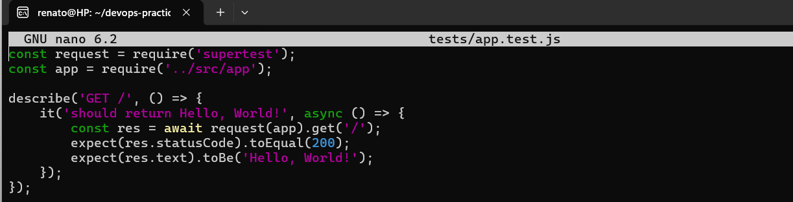
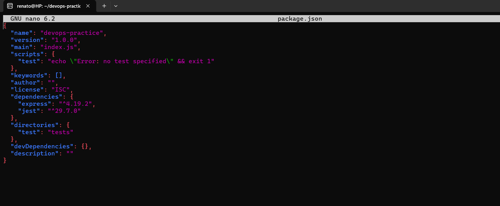
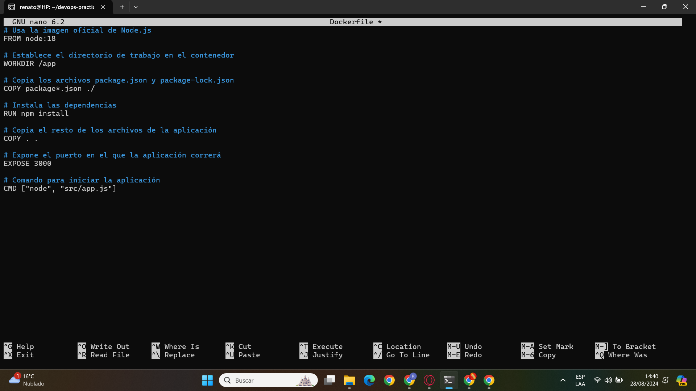

# Documentación del Proyecto DevOps Practice

## Configuración del Entorno y Desarrollo

### Inicialización del Proyecto
Se creó la estructura básica del proyecto y se inicializó un proyecto de Node.js utilizando Node.js versión 18.

#### Código
mkdir devops-practice
cd devops-practice
npm init -y

# Instalación de Dependencias
Instalación de Express para la API y Jest para realizar pruebas.
### Código
npm install express jest

Se presentó un problema, y se tuvo  que instalar la versión 18 de Node,js para poder seguir con los pasos

Una vez arreglado el problema:

# Estructura del Proyecto
Creación de directorios para el código fuente y pruebas unitarias.

mkdir src tests
touch src/app.js tests/app.test.js

### Verificación de la creación de los archivos

# Implementación de la API REST
Se implementó una API REST básica en src/app.js.

### Código
const express = require('express');
const app = express();

app.get('/', (req, res) => {
    res.send('Hello, World!');
});

const port = process.env.PORT || 3000;
app.listen(port, () => {
    console.log(`Server running on port ${port}`);
});

module.exports = app;

# Pruebas Unitarias
Se escribieron pruebas para la API utilizando Jest y Supertest en tests/app.test.js.

### Código
const request = require('supertest');
const app = require('../src/app');

describe('GET /', () => {
    it('should return Hello, World!', async () => {
        const res = await request(app).get('/');
        expect(res.statusCode).toEqual(200);
        expect(res.text).toBe('Hello, World!');
    });
});

# Se configura el script de test en package.json:

# Integración y Entrega Continua
Se configuró un pipeline CI/CD usando GitHub Actions y Docker para automatizar las pruebas y el despliegue.
## CI con GitHub Actions
Configuración de .github/workflows/ci.yml.

## CD con Docker
Dockerización de la aplicación y configuración para el despliegue.

## Docker Compose

Automatización del entorno usando docker-compose.yml.
version: '3.8'
services:
  app:
    build: .
    ports:
      - "3000:3000"
    environment:
      - NODE_ENV=production

### Despliegue Local
Pruebas del despliegue local utilizando Docker.

docker-compose up --build -d

#### Verificación
Se verificó el funcionamiento de la aplicación accediendo a http://localhost:3000.

### Resultado

###### Beneficios de tener un pipeline de Integración Continua (CI) y Entrega Continua (CD)

Al tener un pipeline de (CI) y (CD) nos da beneficios como la eficiencia y calidad en el cual tiene un papel importante en el desarrollo de software pero también es vital para reducir la fricción entre los equipos de desarrollo y operaciones,  creando un entorno de trabajo más armónico y eficiente.

1. Reducción de Errores: Minimiza los errores humanos al estandarizar los procesos de integración y despliegue.
2. Agilidad en Despliegues: Acelera el tiempo de lanzamiento al mercado permitiendo despliegues rápidos y frecuentes.
3. Mejora de la Colaboración: Facilita una mejor comunicación y coordinación entre los equipos de desarrollo y operaciones, asegurando que todos los involucrados estén sincronizados.
4. Feedback Continuo: Permite la detección y corrección temprana de errores, mejorando la calidad del software mediante pruebas y ajustes continuos.
5. Optimización de Recursos: Libera al personal de tareas repetitivas y les permite concentrarse en trabajo de mayor valor, potenciando la innovación y la mejora continua.