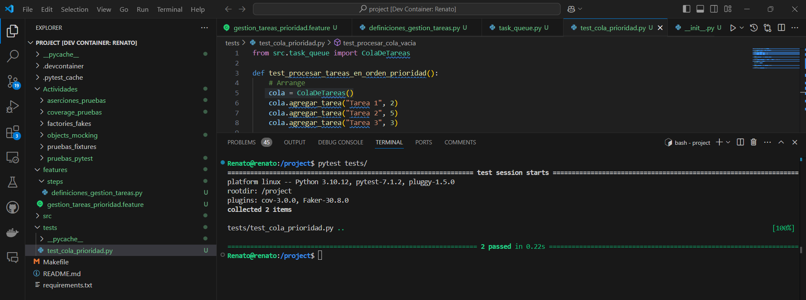

# Ejercicio 1: Implementación de un sistema de colas con prioridades

## Descripción
El ejercicio consiste en desarrollar un sistema de gestión de tareas que permite agregar tareas con diferentes niveles de prioridad. El sistema garantiza que las tareas más importantes se procesen primero, mientras que aquellas con igual prioridad se procesan en el orden en que fueron ingresadas. Además, se requiere que el sistema maneje adecuadamente situaciones en las que se intente procesar una tarea cuando no hay ninguna disponible.

## Objetivo
Desarrollar una cola de prioridad que ordene y procese tareas según su urgencia y orden de llegada, asegurando un comportamiento predecible y gestionando las excepciones de forma adecuada. El sistema se prueba utilizando técnicas de desarrollo guiadas por comportamiento (BDD) y pruebas unitarias.

## Historia de Usuario
**Como** usuario del sistema, 
**quiero** agregar tareas con distintos niveles de prioridad 
**para** que las tareas más urgentes sean procesadas primero, y que si varias tareas tienen la misma prioridad, se respeten sus órdenes de llegada.

## Criterios de Aceptación
1. Las tareas deben procesarse en orden de prioridad, comenzando por las más urgentes (mayor prioridad).
2. Cuando dos o más tareas tienen la misma prioridad, deben procesarse en el orden en que fueron agregadas.
3. El sistema debe manejar correctamente una excepción cuando se intente procesar una tarea en una cola vacía, mostrando un error adecuado.

## Diseño del Sistema
El sistema implementa una **cola de prioridad** utilizando la biblioteca `heapq` de Python, que permite gestionar de manera eficiente la extracción de tareas con prioridad más alta. Las tareas se almacenan como tuplas donde:
- El primer valor es la prioridad (invertida para que la mayor prioridad sea la primera en ser procesada).
- El segundo valor es un contador que asegura el orden de llegada cuando las prioridades son iguales.
- El tercer valor es el nombre de la tarea.

## Implementación
1. **Clase ColaDeTareas (cola_tarea.py)**:
   - **`agregar_tarea(nombre, prioridad)`**: Agrega una tarea con su prioridad a la cola.
   - **`procesar_tareas()`**: Procesa todas las tareas en la cola, retornando una lista con el orden de procesamiento.

2. **Pruebas Unitarias (test_cola_prioridad.py)**:
   - **`test_procesar_tareas_en_orden_de_prioridad()`**: Verifica que las tareas con la misma prioridad se procesen según el orden en que fueron agregadas.
   - **`test_procesar_cola_vacia()`**: Asegura que se lanza una excepción cuando se intenta procesar una tarea en una cola vacía.

    ***Resultado**

    

3. **Pruebas BDD (gestion_tareas_prioridad.feature)**:
   - Definido en Gherkin, describe escenarios donde se agregan tareas con diferentes prioridades y se verifica su procesamiento, así como el manejo de errores en una cola vacía.

    ***Resultado***

    

4. **Pasos de Pruebas en Behave (gestion_tareas_prioridad_steps.py)**:
   - Implementación de pasos para agregar tareas, procesarlas y verificar que el sistema las maneje en el orden correcto. Además, se define un paso para manejar la excepción en el caso de la cola vacía.
   
## Escenarios de Prueba
1. **Procesamiento de Tareas por Prioridad**:
   - Se agregan varias tareas con diferentes niveles de prioridad, y el sistema debe procesar primero la tarea con mayor prioridad.
   
2. **Procesamiento de Tareas con Igual Prioridad**:
   - Si dos tareas tienen la misma prioridad, el sistema debe procesarlas en el orden en que fueron agregadas.

3. **Manejo de Excepción en Cola Vacía**:
   - Verifica que se lanza una excepción si se intenta procesar una tarea cuando la cola está vacía, mostrando un error de tipo `IndexError`.

## Conclusión
Este sistema de gestión de tareas con colas de prioridad asegura que las tareas se procesen de manera eficiente, respetando las urgencias y el orden de llegada cuando sea necesario. Las pruebas unitarias y las pruebas de comportamiento BDD (Behavior-Driven Development) garantizan que el sistema funcione correctamente bajo diferentes escenarios y que se manejen adecuadamente las excepciones.

