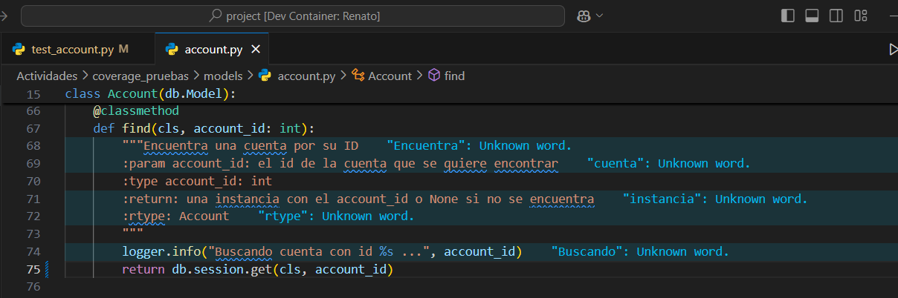

# Actividad 15
Esta actividad se realizó el día: 29/10/24

Se realizó la Actividad Coverage-Pruebas: https://github.com/kapumota/Actividades-CC3S2/tree/main/2024-2/Semana5/TDD-BDD/Actividades/coverage_pruebas

Se siguió exactamente como dicen los pasos de la actividad. Se adjuntan capturas de pantalla:

1. 

2. 

3. 

4. 

5. 

6. 

7. 

8. 

9. 

10. 
