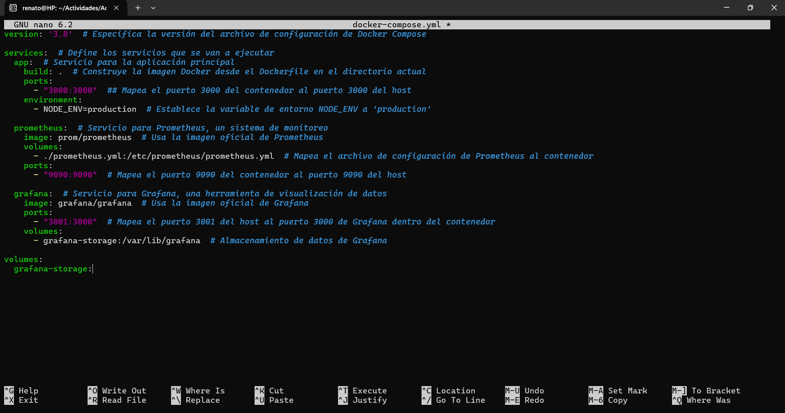
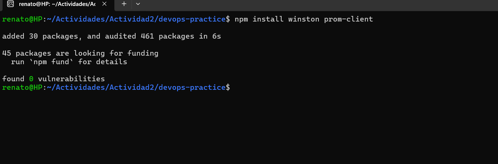
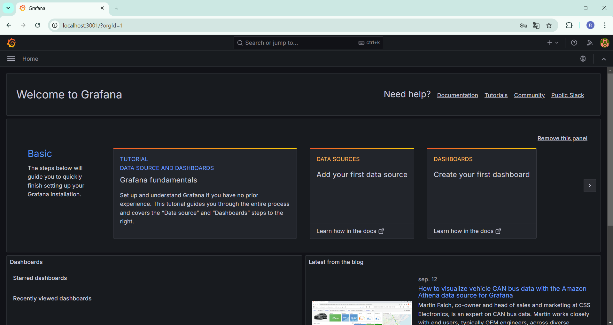
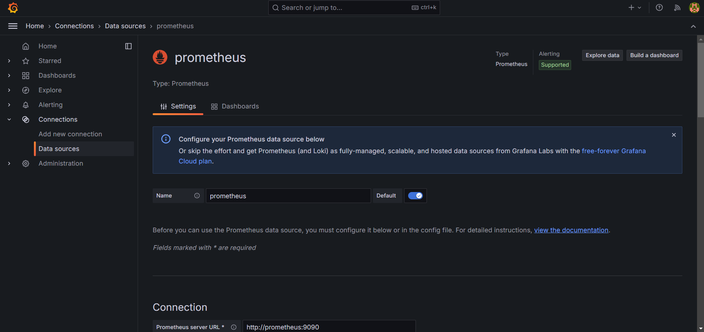
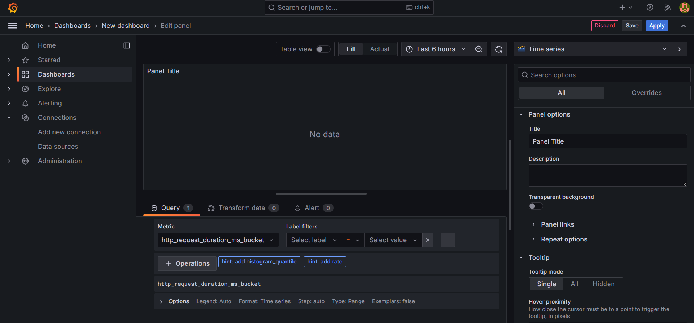
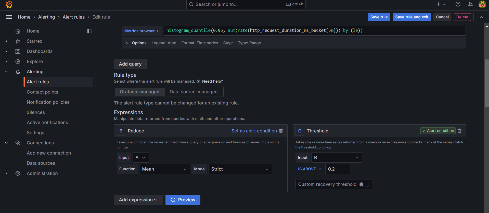
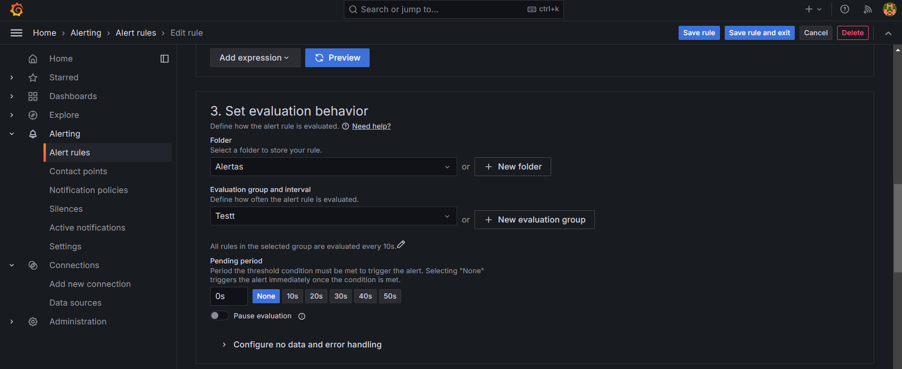
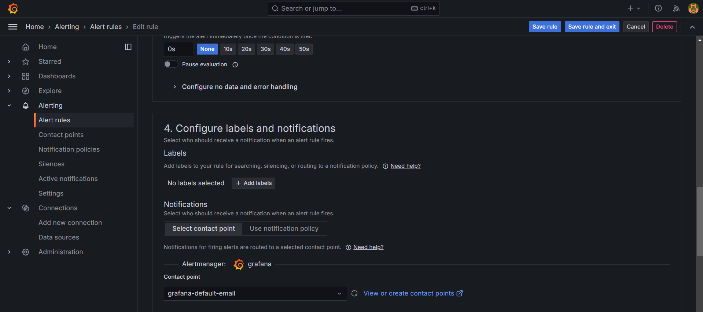
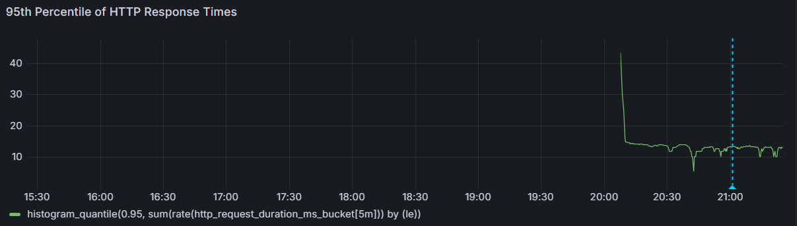
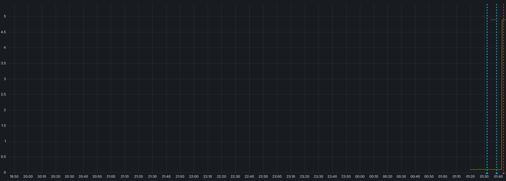

# Documentación de la Actividad 2
Una vez organizado los documentos y teniendo una estructura organizada, se creó la carpeta "Actividad2" en la cual contendrá "devops-practice"


## Creamos nuestro archivo: app.js


## Creamos nuestro app.test.js


## Configuramos nuestro package.json


## Integramos seguridad con la herramienta de análisis de seguridad estática: npm audit

### Código:
npm audit

## Actualizamos el archivo .github/workflows/ci-actividad2.yml


## Creamos el Dockerfile


## Construimos y corremos el contenedor


### Resultado


## Automatiza la gestión de contenedores usando Docker Compose

### Creamos el docker-compose.yml


## Corremos la aplicación usando Docker Compose


### Resultado


## Configuración de Prometheus y Grafana para monitorear la aplicación:

### Creamos el archivo prometheus.yml


## Configuramos Grafana utilizando un docker-compose.yml actualizado


## Corremos la aplicación


## Se tuvo un problema ya que Grafana no podía verse


## Se hace un cambio en el docker-compose


## Resultado de la aplicación


## Resultado de prometheus


## Resultado de grafana


## Al final se unió en un solo archivo ci.yml, en el cual para la actividad2 se puso en comentarios


## Aplicamos los siguientes comandos uno para que construya la imágen y otro para el test
- **`docker compose --build -d`**: Construye las imágenes de los servicios definidos en el archivo **`docker-compose.yml`** y las ejecuta en segundo plano.
- **`docker exec devops-practice-app-1 npm test`**: Ejecuta el comando **`npm test`** en el contenedor con nombre **`devops-practice-app-1`**.


# Implementación de observabilidad y aclaración
## Configuración del Pipeline de CI/CD

Para integrar pruebas de seguridad automatizadas en nuestro pipeline, utilizamos GitHub Actions y `npm audit`, una herramienta que revisa las dependencias de un proyecto Node.js en busca de vulnerabilidades conocidas.

### Pasos para la configuración:
1. **Crear un archivo de workflow en GitHub Actions:**
   - Ubicación: `.github/workflows/ci.yml`
   - Contenido:
     ```yaml
     name: Node.js CI con pruebas de seguridad

     on:
       push:
         branches: [ main ]
       pull_request:
         branches: [ main ]

     jobs:
       build:
         runs-on: ubuntu-latest

         steps:
         - uses: actions/checkout@v2
         - name: Set up Node.js
           uses: actions/setup-node@v2
           with:
             node-version: '14'
         - name: Install dependencies
           run: npm install
         - name: Run tests
           run: npm test
         - name: Perform security audit
           run: npm audit
     ```
   - Este workflow instala las dependencias, ejecuta pruebas y realiza un análisis de seguridad de las dependencias.

2. **Introducir una vulnerabilidad intencionada:**
   - Modificar el archivo `package.json` para incluir una versión obsoleta de una librería conocida por tener vulnerabilidades, como `lodash@4.17.15`.
   - Ejecutar el pipeline para observar cómo `npm audit` detecta y reporta la vulnerabilidad.

## Implementación de Observabilidad
Hemos hablado de observabilidad en la anterior actividad y sabemos que es esencial en el campo de desarrollo ya que permite a los equipos entender el estado interno de sus sistemas a partir de los datos externos que estos generan. En este caso usamos las siguientes herramientas:

### Herramientas Utilizadas
-Prometheus: Utilizado para recoger métricas del sistema y de la aplicación en tiempo real. Las métricas son almacenadas como series temporales, accesibles mediante consultas para análisis o alertas.

-Grafana: Empleado para visualizar las métricas recopiladas por Prometheus. Ofrece dashboards configurables que permiten ver el estado y rendimiento de la aplicación y la infraestructura de manera gráfica y en tiempo real.

## Reflexión sobre las Prácticas de DevOps
La integración de Docker y Docker Compose ha mejorado nuestros procesos de desarrollo y despliegue al mantener la consistencia mediante Infraestructura como Código (IaC), reduciendo la variabilidad y simplificando el control de versiones y las reversiones.

GitHub Actions en nuestra CI/CD y npm audit para escaneo de vulnerabilidades han incrementado significativamente la seguridad del desarrollo, asegurando que el nuevo código no introduzca fallos y mantenga la integridad en producción.

Prometheus y Grafana nos han brindado una visión detallada del rendimiento y la salud de las aplicaciones, permitiendo una detección y resolución proactiva de problemas, lo que reduce el tiempo de inactividad y mejora la experiencia del usuario.

En resumen, estas herramientas y prácticas refuerzan nuestro entorno DevOps al mejorar la automatización, seguridad y monitoreo, alineándose con los principios de DevSecOps para mitigar riesgos y reducir costos operativos.


# Ejercicios Adicionales - Parte Práctica

# **Ejercicio 1: Integración continua y devSecOps**

## Implementación

En este caso implementamos nuestro `devops-practice` ya que es un pipeline de CI/CD, el cual incluye pruebas de seguridad automatizadas mediante GitHub Actions. Además, tal como se vio en la Actividad2 usamos la herramienta de análisis de seguridad `npm audit` para evaluar las vulnerabilidades en nuestras dependencias.

### Este es nuestro ci.yml
``` ci.yml

#Actividad 1

name: CI/CD Pipeline

on:
  push:
    branches: [ main ]
  pull_request:
    branches: [ main ]

jobs:
  build:
    runs-on: ubuntu-latest

    steps:
    - name: Checkout code
      uses: actions/checkout@v2

    - name: Set up Node.js
      uses: actions/setup-node@v2
      with:
        node-version: '18'

    - name: Install dependencies
      run: npm install
      working-directory: ./Actividad1/devops-practice

    - name: Run tests
      run: npm test
      working-directory: ./Actividad1/devops-practice

    - name: Build Docker image
      run: docker build -t devops-practice .
      working-directory: ./Actividad1/devops-practice

    - name: Run Docker container
      run: docker run -d -p 3000:3000 devops-practice
      working-directory: ./Actividad1/devops-practice

# Actividad 2

#name: CI/CD Pipeline

#on:
#  push:
#    branches: [ main ]
#  pull_request:
#    branches: [ main ]

#jobs:
#  build:
#    runs-on: ubuntu-latest

#    steps:
#    - name: Checkout code
#      uses: actions/checkout@v2

#    - name: Set up Node.js
#      uses: actions/setup-node@v2
#      with:
#       node-version: '18'

#    - name: Install dependencies
#      run: npm install
#      working-directory: ./Actividad2/devops-practice

#    - name: Run tests
#      run: npm test
#      working-directory: ./Actividad2/devops-practice

#    - name: Run security audit
#      run: npm audit
#      working-directory: ./Actividad2/devops-practice
```

1. Primero, introducimos una vulnerabilidad intencional: Se modifica el `package.json` para incluir una dependencia obsoleta que se sabe que tiene vulnerabilidades.

``` json

  "name": "devops-practice",
  "version": "1.0.0",
  "scripts": {
    "test": "jest"
  },
  "dependencies": {
    "express": "4.16.0" // Suponiendo que esta versión tiene vulnerabilidades conocidas
  },
  "devDependencies": {
    "jest": "^27.5.1",
    "supertest": "^6.3.4"
  },
  "main": "index.js",
  "directories": {
    "test": "tests"
  },
  "keywords": [],
  "author": "",
  "license": "ISC",
  "description": ""

```


2. Segundo, todo este cambio lo subimos a nuestro repositorio haciendo git y push para que nuestro GithubActions se active. Pero para eso necesitamos descomentar el código de la Actividad2, y comentar el código de la Actividad1 para que funcione lo que hemos hecho.


3. Tercero, revisamos en nuestro repositorio en la parte de `Actions`, vemos todas las acciones que hemos realizado. 


4. Cuarto, revisamos los detalles del proceso que hizo nuestro GithubActions:


## Evaluación 

1. **Impacto de detectar la vulnerabilidad en una fase temprana del desarrollo:**
- **Reducción de Riesgos:** Detectar una vulnerabilidad en etapas tempranas minimiza el riesgo de comprometer la seguridad del sistema una vez en producción. Esto protege tanto a la empresa como a sus usuarios de posibles brechas de seguridad.
- **Costo y Esfuerzo:** Corregir una vulnerabilidad durante el desarrollo es mucho menos costoso y menos laborioso que hacerlo una vez que el producto está en el mercado. Las correcciones en producción pueden requerir despliegues de emergencia y parches rápidos que son disruptivos y costosos.
- **Consecuencias de qué hubiera pasado si la vulnerabilidad llegaba a producción:** Si una vulnerabilidad crítica llega a producción, podría resultar en la pérdida de datos sensibles, ataques de seguridad, y un daño considerable a la reputación de la empresa. Además, esto podría llevar a interrupciones del servicio mientras se trabaja en solucionar la vulnerabilidad, generando pérdidas financieras adicionales.

2. **Integración de DevSecOps para prevenir problemas de seguridad y reducir costos:**

- **Incorporación de Seguridad en el Ciclo de Vida:** DevSecOps integra prácticas de seguridad desde el inicio del desarrollo del software. Esto ayuda a identificar y mitigar vulnerabilidades de manera proactiva y a fomentar una cultura de seguridad continua entre los equipos de desarrollo.
- **Automatización de Procesos de Seguridad:** La automatización de pruebas de seguridad y revisiones de configuración ahorra tiempo y asegura que se mantengan estándares de seguridad consistentes. Esto no solo mejora la eficiencia operativa sino que también contribuye a reducir los costos asociados con las pruebas de seguridad manuales y los errores humanos.
- **Beneficios a Largo Plazo:** Adoptar un enfoque de DevSecOps puede resultar en un ahorro significativo de costos a largo plazo, reduciendo la necesidad de intervenciones costosas en etapas posteriores del desarrollo y durante la fase de producción, y manteniendo una postura de seguridad robusta en todo momento.


# **Ejercicio 2: Infraestructura como código y gestión de configuración**

1. **Implementación**

- Para poder resolver la parte prática del Ejercicio2 usaremos nuestra carpeta `devops-practice` el cual contiene a los archivos Docker y Docker Compose:

```Dockerfile
# Usa la imagen oficial de Node.js
FROM node:18

# Establece el directorio de trabajo en el contenedor
WORKDIR /app

# Copia los archivos package.json y package-lock.json
COPY package*.json ./

# Instala las dependencias
RUN npm install

# Copia el resto de los archivos de la aplicación
COPY . .

# Expone el puerto en el que la aplicación correrá
EXPOSE 3000

# Comando para iniciar la aplicación
CMD ["node", "src/app.js"]
```


```Docker-Compose

version: '3.8'  # Especifica la versión del archivo de configuración de Docker Compose
services:  # Define los servicios que se van a ejecutar
  app:  # Servicio para la aplicación principal
    build: .  # Construye la imagen Docker desde el Dockerfile en el directorio actual
    ports:
      - "3000:3000"  # Mapea el puerto 3000 del contenedor al puerto 3000 del host
    environment:
      - NODE_ENV=production  # Establece la variable de entorno NODE_ENV a 'production'

  prometheus:  # Servicio para Prometheus, un sistema de monitoreo
    image: prom/prometheus  # Usa la imagen oficial de Prometheus
    volumes:
      - ./prometheus.yml:/etc/prometheus/prometheus.yml  # Mapea el archivo de configuración de Prometheus al contenedor    ports:
      - "9090:9090"  # Mapea el puerto 9090 del contenedor al puerto 9090 del host

  grafana:  # Servicio para Grafana, una herramienta de visualización de datos
    image: grafana/grafana  # Usa la imagen oficial de Grafana
    ports:
      - "3001:3000"  # Mapea el puerto 3001 del host al puerto 3000 de Grafana dentro del contenedor

``` 

- Configuramos nuestro Docker-compose para usar variables de entorno de desarrollo y producción
  - Se modifica la variable de entorno `NODE ENV`:
    - Development: `NODE_ENV=development` y `DEBUG=true`. Esto activa las funciones de depuración y puede producir logs más verbosos, lo cual es útil durante el desarrollo para rastrear errores y comprender el comportamiento de la aplicación.
    - Production: `NODE_ENV=production. Esto optimiza la aplicación para el rendimiento en un entorno de producción, generalmente reduciendo la cantidad de logs detallados y ofreciendo respuestas de error más genéricas para seguridad.

- También tenemos que hacer un cambio en el archivo `app.js` 


- Por último hacemos este cambio en docker-compose


2. **Simulación**

- Se realiza el despliegue primero en un entorno de desarrollo y luego en producción
  - Primero se construye la imagen del Docker con el comando: `docker-compose build`
  
    - **Para desarrollo:** Usamos el comando `docker-compose up app-dev` el cual inicia el servicio `app-dev` definido en el docker-compose.yml, que está configurado   para desarrollo. Esto incluirá la habilitación de volúmenes para el código fuente y el modo de depuración.

      

      - ***Resultado Para Desarrollo***:
      

    - **Para producción:** Usamos el comando `docker-compose up app-prod` el cual inicia el servicio `app-prod`, que está configurado para un entorno de producción, con las optimizaciones y configuraciones de seguridad correspondientes.

      

      - ***Resultado Para Desarrollo***:
            
      
- Cambiamos de puerto que en este caso es el 5000 


  - Desplegamos nuevamente, para esto reiniciamos el servidor para que el nuevo mapeo de puertos tenga efecto
    
    

    - ***Resultado***
    

**Nota: Se agregó un comodín para facilitar la subida de imagenes: `git add Imagenes/Foto[2][6-9].png Imagenes/Foto3[0-5].png`**

3. **Evaluación**
- Compara la consistencia entre los entornos. ¿Cómo asegura IaC que ambos entornos se mantengan alineados?

IaC asegura que los entornos de desarrollo y producción se mantengan alineados codificando toda la configuración en archivos (como docker-compose.yml). Esto garantiza que cada entorno se construya de la misma manera, y bueno esto ayuda eliminando las diferencias causadas por configuraciones manuales. Cada cambio se aplica de forma uniforme, asegurando que todos los entornos sean consistentes entre sí.

- Discute cómo IaC ayuda a escalar aplicaciones en diferentes entornos.

La Infraestructura como Código (IaC) facilita la escalabilidad al permitir la automatización de la creación y gestión de entornos. Puedes aumentar o reducir recursos, ajustar configuraciones o desplegar en nuevas ubicaciones simplemente modificando los archivos de configuración. Esta automatización hace que sea fácil escalar la infraestructura de manera eficiente y controlada, adaptándose rápidamente a las necesidades del negocio.


# **Ejercicio 3**

1. **Implementación**
- Usamos nuestra carpeta de `devops-practice` y configuramos nuestro archivo `docker-compose.yml`, solo agregamos esta línea:

```yml en la parte de grafana
    volumes:
      - grafana-storage:/var/lib/grafana

volumes:
  grafana-storage:

```


- Modificamos app.js para añadir registros detallados y recopilar métricas. Para eso usamos las siguientes herramientas:
  - Uso de `winston`:Es una biblioteca popular para logging en aplicaciones Node.js. Podemos configurar diferentes niveles de logging (como error, info, debug) y dirigir estos logs a diferentes destinos (consola, archivos, sistemas externos).

  - Uso de `prom-client`: Esta librería facilita la exposición de métricas que pueden ser recolectadas por Prometheus. Generalmente, añadirás un endpoint /metrics a tu aplicación para que Prometheus pueda acceder y recopilar estas métricas.

```Se añade el código de app.js modificado
const express = require('express');  // Importa el módulo Express para crear la aplicación web
const winston = require('winston');  // Importa Winston para el logging
const client = require('prom-client');  // Importa prom-client para la recolección de métricas

// Crear una instancia de la aplicación Express
const app = express();

// Configurar el logger de Winston
const logger = winston.createLogger({
    level: 'info',  // Nivel de log, puede ser 'info', 'debug', 'warn', etc.
    format: winston.format.combine(
        winston.format.timestamp(),  // Añade un timestamp a cada log
        winston.format.json()  // Formato de log en JSON
    ),
    transports: [
        new winston.transports.Console({
            format: winston.format.simple()  // Formato simple para la salida en consola
        }),
        new winston.transports.File({ filename: 'server.log' })  // Registra los logs en un archivo
    ]
});

// Recolecta métricas predeterminadas de Node.js
const collectDefaultMetrics = client.collectDefaultMetrics;
collectDefaultMetrics({ timeout: 5000 });  // Recolecta métricas cada 5 segundos

// Define una métrica personalizada: duración de las solicitudes HTTP
const httpRequestDurationMicroseconds = new client.Histogram({
    name: 'http_request_duration_ms',  // Nombre de la métrica
    help: 'Duration of HTTP requests in ms',  // Descripción de la métrica
    labelNames: ['method', 'path', 'status'],  // Etiquetas para diferenciar las métricas
    buckets: [0.1, 5, 15, 50, 100, 500]  // Rango de duraciones en milisegundos
});

// Middleware para logear solicitudes y medir duración
app.use((req, res, next) => {
    const start = process.hrtime();  // Registra el tiempo de inicio

    res.on('finish', () => {
        const durationInMilliseconds = process.hrtime(start)[1] / 1e6;  // Calcula la duración de la solicitud
        httpRequestDurationMicroseconds.labels(req.method, req.originalUrl, res.statusCode).observe(durationInMilliseconds);  // Observa la duración en la métrica
        logger.info(`Handled ${req.method} request to ${req.originalUrl} with status code ${res.statusCode} in ${durationInMilliseconds} ms`);  // Log de la solicitud
    });

    next();  // Pasa el control al siguiente middleware
});

// Ruta raíz que responde con 'Hello, World!'
app.get('/', (req, res) => {
    res.send('Hello, World!');  // Respuesta simple al acceso a la raíz
});

// Ruta para exponer las métricas a Prometheus
app.get('/metrics', async (req, res) => {
    res.set('Content-Type', client.register.contentType);  // Establece el tipo de contenido como el formato de métricas de Prometheus
    res.end(await client.register.metrics());  // Envía las métricas a Prometheus
});

// Verifica si el módulo actual es el módulo principal y ejecuta el servidor
if (require.main === module) {
    const port = process.env.PORT || 3000;  // Obtiene el puerto desde la variable de entorno o usa el puerto 3000 por defecto
    const server = app.listen(port, () => logger.info(`Server running on port ${port}`));  // Inicia el servidor y loggea el puerto
    module.exports = server;  // Exporta el servidor para su uso en otros módulos
} else {
    module.exports = app;  // Exporta la aplicación para su uso en otros módulos
}

```  

2. **Experimentación**
- Para poder usar las depencias las tenemos que instalar con el siguiente comando: `npm install winston prom-client`

- Usamos `setTimeout` para introducir un retardo en la respuesta de la ruta seleccionada

```app.js complemento
// Ruta que simula un tiempo de respuesta lento
app.get('/slow', (req, res) => {
    // Log inicial sobre la recepción de la solicitud
    logger.info('Received a slow request');

    // Simula un retardo de 3 segundos antes de responder
    setTimeout(() => {
        res.send('Response with intentional delay');
        // Log que la solicitud ha sido procesada después del retardo
        logger.info('Processed the slow request after a 3-second delay');
    }, 3000); // Retraso de 3000 milisegundos (3 segundos)
});

```
- Luego escribimos los siguientes comandos: `docker-compose build` y luego `docker-compose up -d`.
- En grafana ingresamos `admin` tanto en username como en password


- Para eso en **Connections**, damos clic en Data sources y lo vinculamos con Prometheus.

- En Dashboard igual por defecto agregamos Prometheus



- En Alerta seguimos estos pasos




- Resultado


- Resultado-modelo


3. **Evaluación:  Observabilidad y monitoreo avanzado**
- Discute cómo la observabilidad permite identificar problemas que no serían evidentes con un monitoreo tradicional.
A lo largo de esta actividad, la observabilidad se diferencia del monitoreo tradicional en que no solo se enfoca en recolectar datos y métricas predefinidas, sino que también permite inspeccionar y entender el estado de los sistemas desde la data generada por ellos mismos. Es importante ya que permite identificar problemas que no son evidentes a simple vista o que no se habrían considerado en la configuración inicial del sistema de monitoreo.

- Reflexiona sobre la importancia de las métricas, logs y trazas en la gestión de sistemas modernos

Estos tres términos son bien importantes y podemos enumerarlos:
a. Métricas: Indican el rendimiento y salud del sistema en tiempo real, ayudando a monitorizar y optimizar las operaciones.
b. Logs: Ofrecen un registro detallado de eventos, crucial para diagnosticar problemas y entender el comportamiento del sistema.
c. Trazas: Son importantes en entornos distribuidos para rastrear procesos complejos a través de varios servicios y localizar fallos o cuellos de botella.


