**Para esta Actividad se trabajará con un Índice para tener más orden y claridad**
# Índice
1. [Conceptos básicos de Git](#conceptos-básicos-de-git)
   1. [Git config: Preséntate a Git](#1-git-config-preséntate-a-git)
   2. [git init: Donde comienza tu viaje de código](#2-git-init-donde-comienza-tu-viaje-de-código)
   3. [git add: Preparando tu código](#3-git-add-preparando-tu-código)
   4. [git commit: Registra cambios](#4-git-commit-registra-cambios)
   5. [git log: Recorrer el árbol de commits](#5-git-log-recorrer-el-árbol-de-commits)
   6. [git branch: Entendiendo los conceptos básicos de Git branch](#6-git-branch-entendiendo-los-conceptos-básicos-de-git-branch)
   7. [git checkout/git switch: Cambiar entre branches](#7-git-checkoutgit-switch-cambiar-entre-branches)
   8. [git merge: Fusionando branches y git branch -d: Eliminando una Branch](#8-git-merge-fusionando-branches-y-git-branch--d-eliminando-una-branch)
2. [Preguntas](#preguntas)
3. [Ejercicios](#ejercicios)
   1. [Ejercicio 1: Manejo avanzado de branches y resolución de conflictos](#ejercicio-1-manejo-avanzado-de-branches-y-resolución-de-conflictos)
   2. [Ejercicio 2: Exploración y manipulación del historial de commits](#ejercicio-2-exploración-y-manipulación-del-historial-de-commits)
   3. [Ejercicio 3: Creación y gestión de branches desde commits específicos](#ejercicio-3-creación-y-gestión-de-branches-desde-commits-específicos)
   4. [Ejercicio 4: Manipulación y restauración de commits con git reset y git restore](#ejercicio-4-manipulación-y-restauración-de-commits-con-git-reset-y-git-restore)
   5. [Ejercicio 5: Trabajo colaborativo y manejo de Pull Requests](#ejercicio-5-trabajo-colaborativo-y-manejo-de-pull-requests)
   6. [Ejercicio 6: Cherry-Picking y Git Stash](#ejercicio-6-cherry-picking-y-git-stash)
# Conceptos básicos de Git
Para esta Actividad que sería la número 3 se profundizará el uso de Git en la parte práctica.

## 1.git config: Preséntate a Git
Para presentarnos ante Git se ejecutan los siguientes comandos

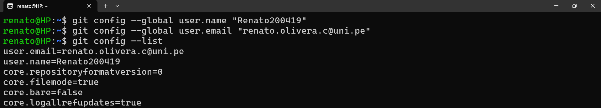

## 2. git init: Donde comienza tu viaje de código
Se crea el directorio y además como ya inicializamos nuestro repositorio desde la Actividad1, por eso sale esos comentarios

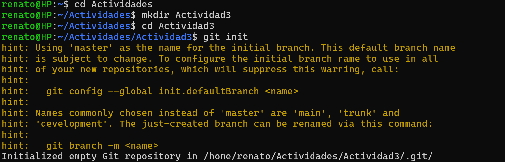

## 3. git add: Preparando tu código 
Se hizo `git add README.md` para agregar al área de preparación de Git ya que al inicio Git no lo rastreaba

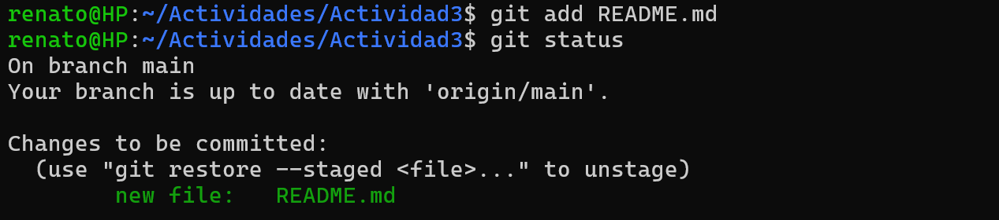

## 4. git commit: registra cambios

En esta parte es importante escribir buenos mensajes de commit ya que ayuda a entender el lector los cambios que se ha realizado.
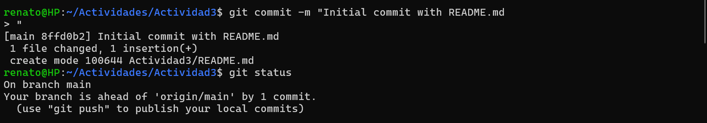

## 5. git log: Recorrer el árbol de commits

Muestra una lista de commits realizados en un repositorio en orden cronológico inverso, es decir, el commit más reciente se muestra primero
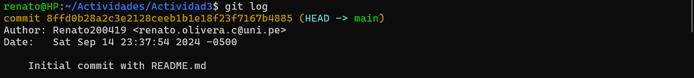


### Pregunta: ¿ Cual es la salida de este comando?
En este repositorio que se tiene branches tiene la siguiente salida:

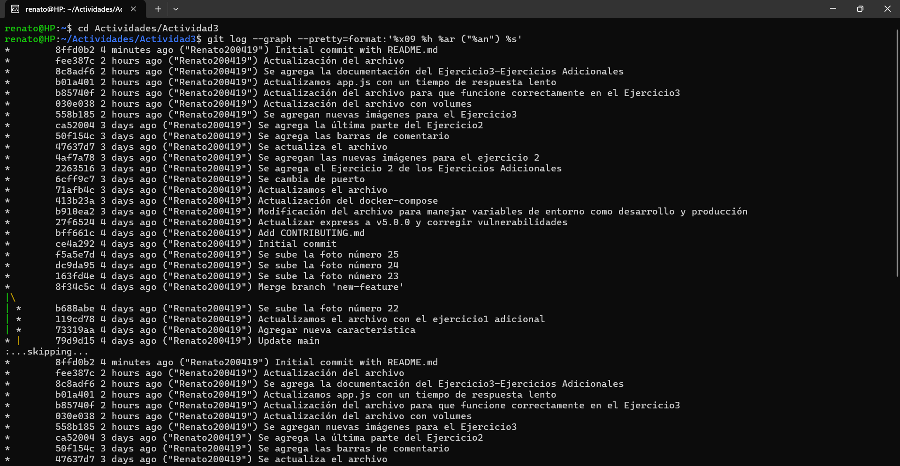

### Pregunta: Intentemos el comando git log en este ejercicio (puedes realizar otra cosa como colocar las cosas en español). Primero, actualiza el archivo README.md y crea un nuevo archivo CONTRIBUTING.md:

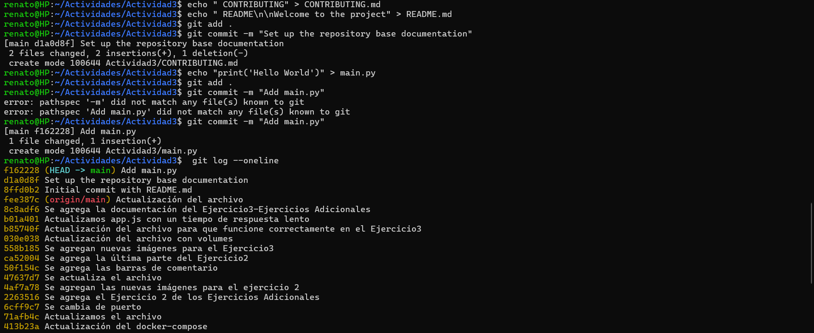

## 6. git branch: Entendiendo los conceptos básicos de Git branch
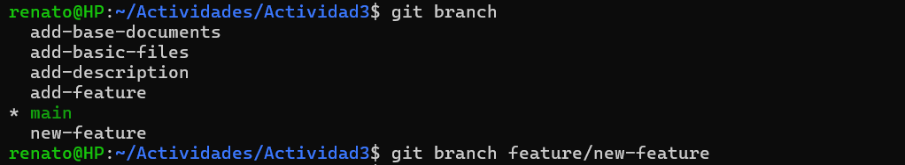

## 7. git checkout/git switch: Cambiar entre branches

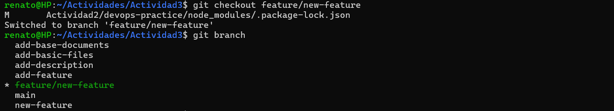


### Ejemplos adicionales

Para estos ejemplos se hicieron los siguientes pasos como crear y cambiar ramas
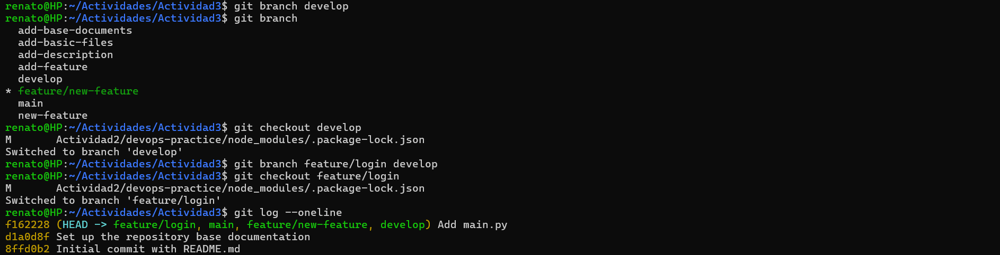


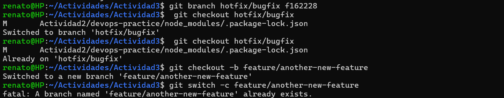

## 8. git merge: Fusionando branches y git branch -d: Eliminando una Branch

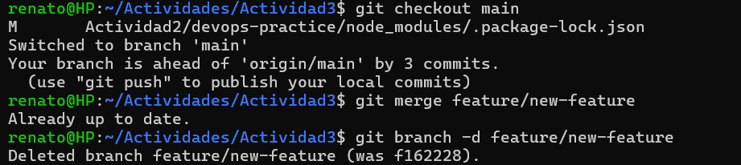
---

# Preguntas

- **Pregunta 1: ¿Cómo te ha ayudado Git a mantener un historial claro y organizado de tus cambios?**
Me ha ayudado mucho en tener un historial claro y organizado al permitirme registrar cada modificación con un mensaje descriptivo. Esto ayuda a rastrear quién hizo qué cambios y por qué, lo cual es esencial para la colaboración y el mantenimiento a largo plazo del proyecto.

- **Pregunta 2: ¿Qué beneficios ves en el uso de branches para desarrollar nuevas características o corregir errores?**
El uso de ramas en el desarrollo de software permite trabajar en nuevas características o correcciones de errores de manera aislada, sin afectar el código principal o de producción. Esto facilita la colaboración entre equipos, mejora la gestión de versiones, permite realizar pruebas y revisiones de forma independiente antes de integrar cambios.

- **Pregunta 3: Realiza una revisión final del historial de commits para asegurarte de que todos los cambios se han registrado correctamente.**
Mostramos el historial del repositorio con el comando: `git log`

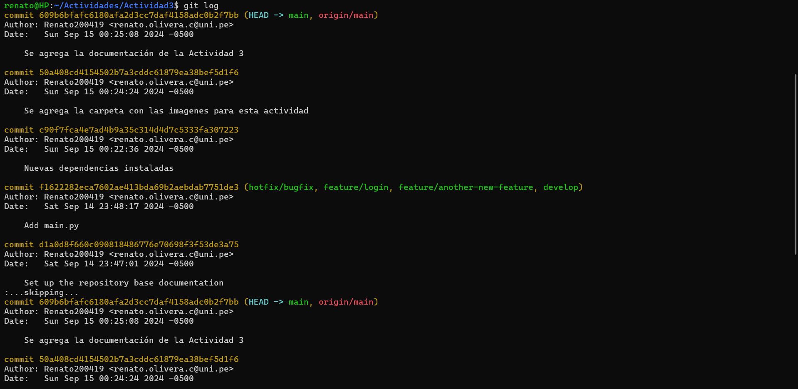

- **Pregunta 4: Revisa el uso de branches y merges para ver cómo Git maneja múltiples líneas de desarrollo.**
El uso de ***branches*** en Git me permite trabajar en múltiples características o correcciones de manera simultánea sin afectar la línea principal de desarrollo, conocida como main. Como por ejemplo se ven las ramas de: main, develop y etc.
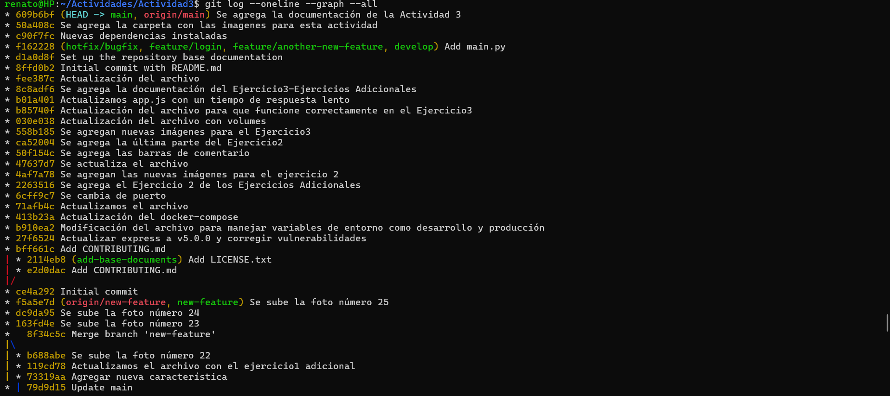

Y aquí hay una captura de un merge
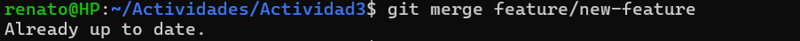

Para ver más a detalle el uso de branches y merges resolveremos los ejercicios a continuación y así responder de mejor manera la pregunta.
---

# Ejercicios
# Ejercicio 1: Manejo avanzado de branches y resolución de conflictos
## Objetivo: 
Practicar la creación, fusión y eliminación de ramas, así como la resolución de conflictos que puedan surgir durante la fusión.

## Instrucciones:
### 1. Crear una nueva rama para una característica:
 - Crea una nueva rama llamada feature/advanced-feature desde la rama main:

```bash
   $ git branch feature/advanced-feature
   $ git checkout feature/advanced-feature
```
 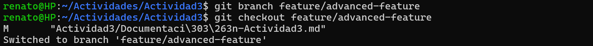

2. Modificar archivos en la nueva rama:
 - Edita el archivo main.py para incluir una función adicional:

   ```python
   def greet():
   print('Hello from advanced feature')
   
   greet()
   ```
 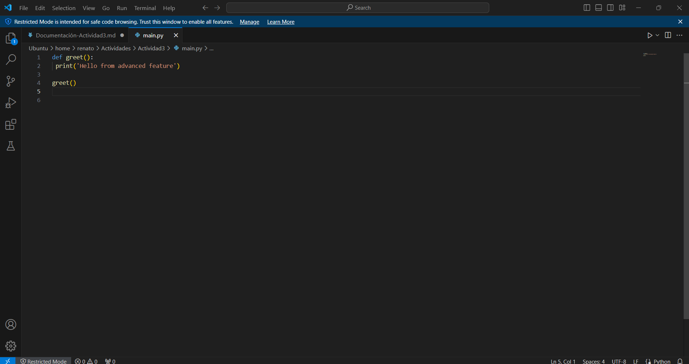

 - Añade y confirma estos cambios en la rama feature/advanced-feature:
 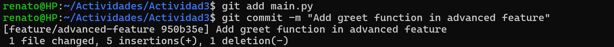

3. Simular un desarrollo paralelo en la rama main:

 - Cambia de nuevo a la rama main:
```bash
$ git checkout main
```
 - Edita el archivo main.py de forma diferente (por ejemplo, cambia el mensaje del print original):
```python
print('Hello World - updated in main')
```

- Añade y confirma estos cambios en la rama main:
```bash
 $ git add main.py
 $ git commit -m "Update main.py message in main branch"
```
 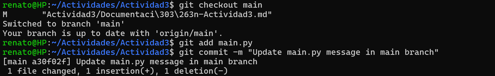

4. Intentar fusionar la rama `feature/advanced-feature en main`:
- Fusiona la rama `feature/advanced-feature` en `main`:

```bash
$ git merge feature/advanced-feature
```

 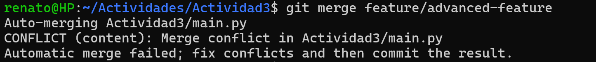


5. Resolver el conflicto de fusión:
 - Git generará un conflicto en main.py. Abre el archivo y resuelve el conflicto manualmente, eligiendo cómo combinar las dos versiones.
 - Después de resolver el conflicto, añade el archivo resuelto y completa la fusión:

**Durante el conflicto en main.py**
 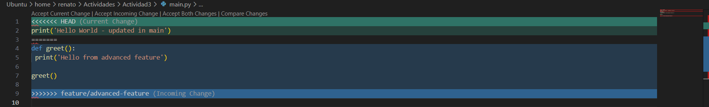

**Solución al conflicto en main.py**
 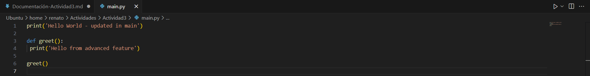


Luego se hace lo siguiente:

```bash
 $ git add main.py
 $ git commit -m "Resolve merge conflict between main and feature/advanced-feature"
```

 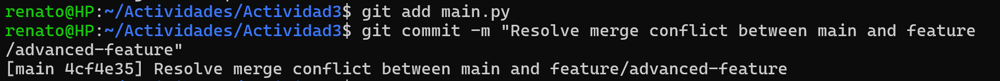
6. Eliminar la rama fusionada:
 - Una vez que hayas fusionado con éxito y resuelto los conflictos, elimina la rama feature/advanced-feature:

```bash
$ git branch -d feature/advanced-feature
```
 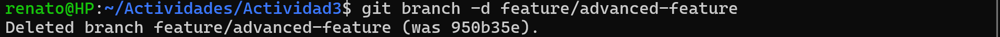

# Ejercicio 2: Exploración y manipulación del historial de commits

## Objetivo: Aprender a navegar y manipular el historial de commits usando comandos avanzados de Git.

## Instrucciones:
1. Ver el historial detallado de commits:
 - Usa el comando git log para explorar el historial de commits, pero esta vez con más detalle:

 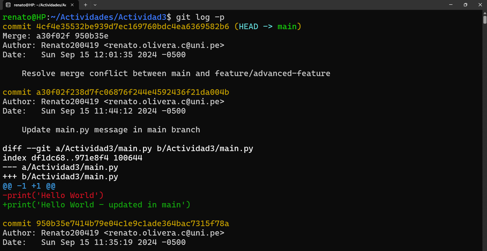

 - Examina las diferencias introducidas en cada commit. ¿Qué cambios fueron realizados en cada uno?
 El comando `git log -p`en Git proporciona una vista detallada del historial de commits junto con las diferencias o "diffs" asociadas a cada uno. Se podría una vista detallada de lo que se ve:

 * **Historial de commits**: git log -p muestra la lista de commits en el repositorio, incluyendo información básica como el hash del commit, el autor, la fecha y el mensaje del commit.

 * **Diferencias ("diffs")**: Para cada commit en el historial, -p añade un detalle crucial: las diferencias entre el estado del código antes y después del commit. Esto incluye:

   - ***Líneas añadidas***: Las líneas de código nuevas se muestran precedidas por un signo de suma (+).
   - ***Líneas eliminadas***: Las líneas eliminadas se muestran precedidas por un signo de resta (-).

2. Filtrar commits por autor:
 - Usa el siguiente comando para mostrar solo los commits realizados por un autor específico:

```bash
$ git log --author="TuNombre"
```

Ejemplo: 

 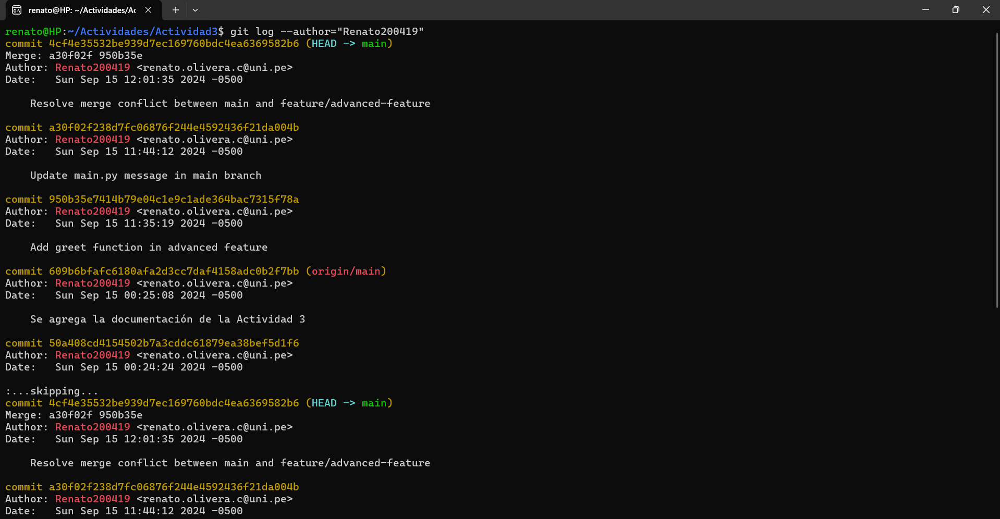


3. Revertir un commit:
 - Imagina que el commit más reciente en main.py no debería haberse hecho. Usa git revert para revertir ese commit:

```bash
$ git revert HEAD
```

Para eso se especifica cuál padre de los *merges* se quiere mantener como base.
 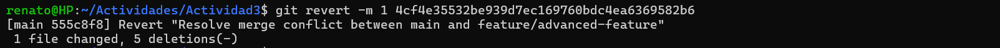

Se guarda y se cierra este archivo: `Ctrl+o` y luego `Enter`. Finalmente `Ctrl+x`
  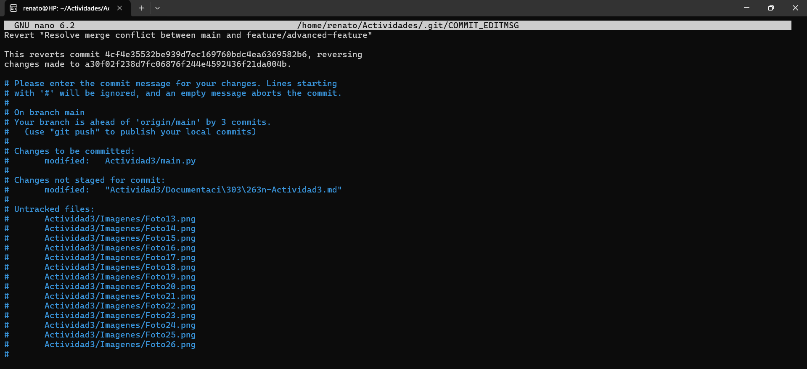

- Verifica que el commit de reversión ha sido añadido correctamente al historial.

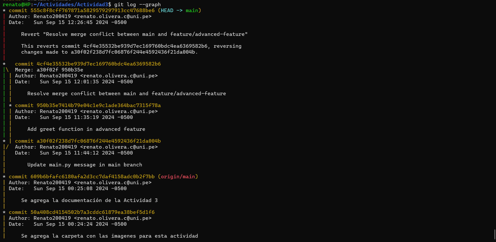


4. Rebase interactivo:
- Realiza un rebase interactivo para combinar varios commits en uno solo. Esto es útil para limpiar el historial de commits antes de una fusión.
- Usa el siguiente comando para empezar el rebase interactivo:
```bash
$ git rebase -i HEAD~3
```
- En el editor que se abre, combina los últimos tres commits en uno solo utilizando la opción squash.

Resultado de ejemplo ya que se hizo commit del archivo .md e imágenes


5. Visualización gráfica del historial:
 - Usa el siguiente comando para ver una representación gráfica del historial de commits:
```bash
$ git log --graph --oneline --all
```

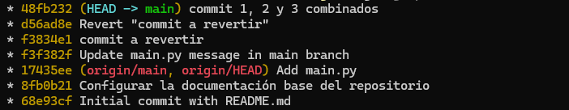
 - Reflexiona sobre cómo el historial de tu proyecto se visualiza en este formato. ¿Qué información adicional puedes inferir?


# Ejercicio 3: Creación y gestión de branches desde commits específicos

## Objetivo
Practicar la creación de ramas desde commits específicos y comprender cómo Git maneja las referencias históricas.

## Instrucciones
1. Crear una nueva rama desde un commit específico:
 - Usa el historial de commits (git log --oneline) para identificar un commit antiguo desde el cual crear una nueva rama:
 ```bash
 $ git log --oneline
 ```
 - Crea una nueva rama bugfix/rollback-feature desde ese commit:

```bash
$ git branch bugfix/rollback-feature <commit-hash>
$ git checkout bugfix/rollback-feature
```

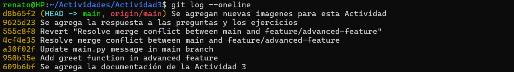

Luego se escoge un commit antiguo, por ejemplo:

 ```bash
$ git branch bugfix/rollback-feature 950b35e
$ git checkout bugfix/rollback-feature
 ```

2. Modificar y confirmar cambios en la nueva rama:
 - Realiza algunas modificaciones en main.py que simulen una corrección de errores:
 ```python
 def greet():
   print('Fixed bug in feature')

 ```
 - Añade y confirma los cambios en la nueva rama:
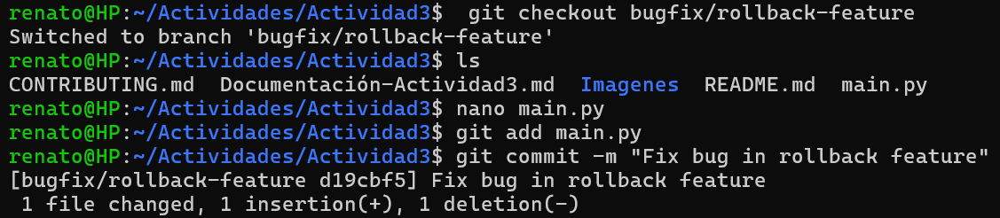

La imagen a continuación es cuando se escribe el comando: `nano main.py`
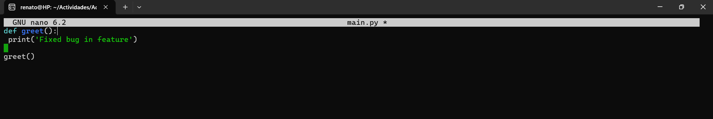

3. Fusionar los cambios en la rama principal:
- Cambia de nuevo a la rama main y fusiona la rama bugfix/rollback-feature:

```bash
 $ git checkout main
 $ git merge bugfix/rollback-feature
```
Al tener un problema con el merge:
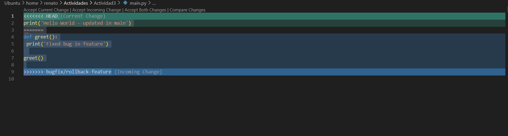

Para resolver este conflicto y mantener ambos cambios, se modifica el archivo main.py para que incluya ambos elementos.
```python
print('Hello World - updated in main')

def greet():
 print('Fixed bug in feature')
 
greet()
```


En el Terminal escribimos lo siguiente:

```bash
 $ git main.py
 $ git commit
```

Y se abrira un editor de texto, guardamos y cerramos.

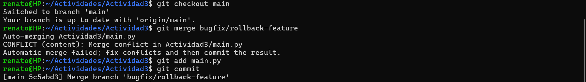

4. Explorar el historial después de la fusión:
- Usa git log y git log --graph para ver cómo se ha integrado el commit en el historial:

```bash
$ git log --graph --oneline
```

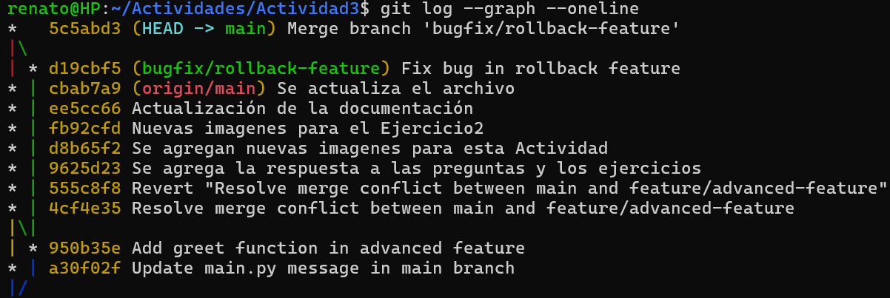


5. Eliminar la rama bugfix/rollback-feature:
 - Una vez fusionados los cambios, elimina la rama bugfix/rollback-feature:

```bash
$ git branch -d bugfix/rollback-feature
```

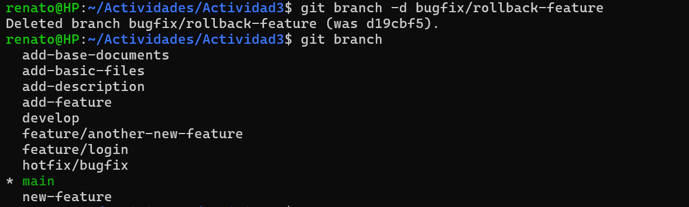


# Ejercicio 4: Manipulación y restauración de commits con `git reset` y `git restore`

## Objetivo
Comprender cómo usar `git reset` y `git restore` para deshacer cambios en el historial y en el área de trabajo.

## Instrucciones

1. Hacer cambios en el archivo main.py:
 - Edita el archivo main.py para introducir un nuevo cambio. Se añade esa línea de código:

```python
print('This change will be reset')
```
Resultado:

```python
print('Hello World - updated in main')

def greet():
 print('Fixed bug in feature')
 
greet()

print('This change will be reset')
```
 - Añade y confirma los cambios:

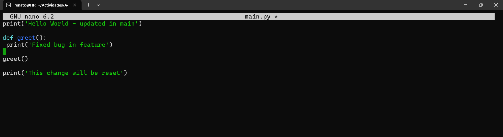

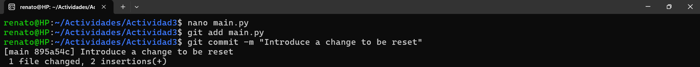

2. Usar git reset para deshacer el commit:
 - Deshaz el commit utilizando git reset para volver al estado anterior:

```bash
$ git reset --hard HEAD~1
```
 - Verifica que el commit ha sido eliminado del historial y que el archivo ha vuelto a su estado anterior.

   - Para verificar usamos el siguiente comando: `git log --graph --oneline`
   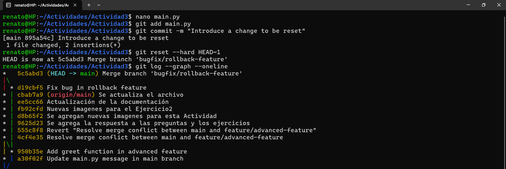

   - Verificamos el archivo main.py
   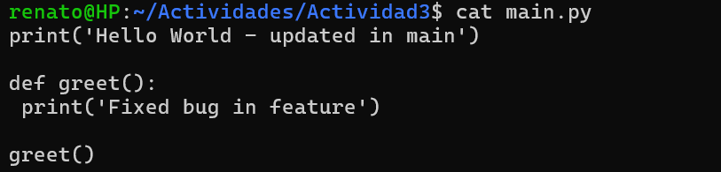

3. Usar git restore para deshacer cambios no confirmados:
 - Realiza un cambio en README.md y no lo confirmes:
```bash
$ echo "Another line in README" >> README.md
$ git status

```
 - Usa git restore para deshacer este cambio no confirmado:
```bash
$ git restore README.md
```
 - Verifica que el cambio no confirmado ha sido revertido.
```bash
$ git status
```
**Resultado**

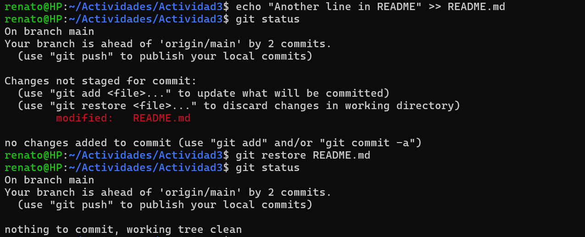


# Ejercicio 5: Trabajo colaborativo y manejo de Pull Requests

## Objetivo
Simular un flujo de trabajo colaborativo utilizando ramas y pull requests.
## Instrucciones

1. Crear un nuevo repositorio remoto:
 - Usa GitHub o GitLab para crear un nuevo repositorio remoto y clónalo localmente:

```bash
$ git clone https://github.com/Renato200419/Curso_Desarrollo_de_Software_CC3S2_24-1.git
```

2. Crear una nueva rama para desarrollo de una característica:
 - En tu repositorio local, crea una nueva rama feature/team-feature:
 ```bash
 $ git branch feature/team-feature
 $ git checkout feature/team-feature
```

3. Realizar cambios y enviar la rama al repositorio remoto:
- Realiza cambios en los archivos del proyecto y confírmalos:
 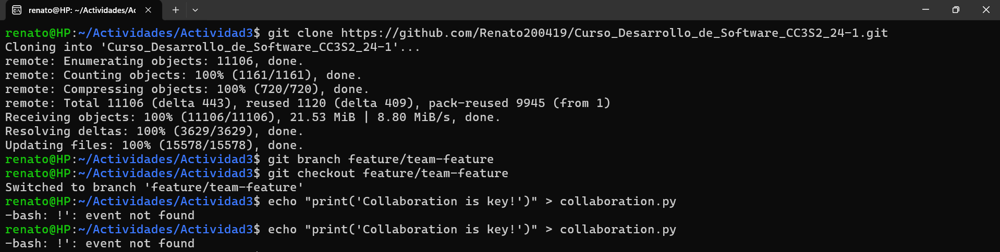

 Para evitar ese error se usa lo siguiente:
 ```bash
 $ echo "print('Collaboration is key\!')" > collaboration.py
 $ git add .
 $ git commit -m "Add collaboration script"

 ```
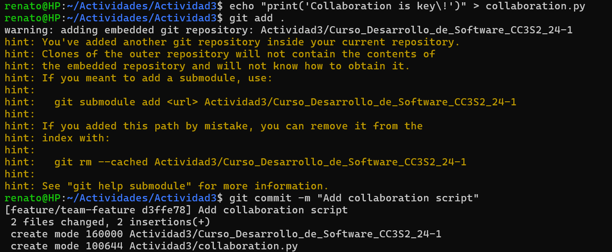
- Envía la rama al repositorio remoto:

 ```bash
$ git push origin feature/team-feature
 ```

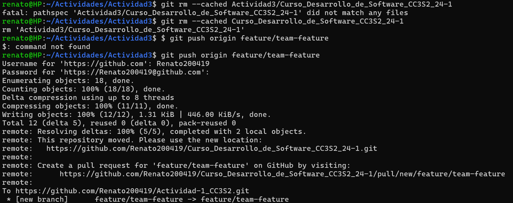

Lo que se hizo fue eliminar la referencia al repositorio interno ya que agregamos un repositorio completo, se pudo haber usado submódulos pero aún no tocamos ese tema por tanto se resuelve el problema del repositorio anidado.

4. Abrir un Pull Request:
 - Abre un Pull Request (PR) en la plataforma remota (GitHub/GitLab) para fusionar feature/team-feature con la rama main.
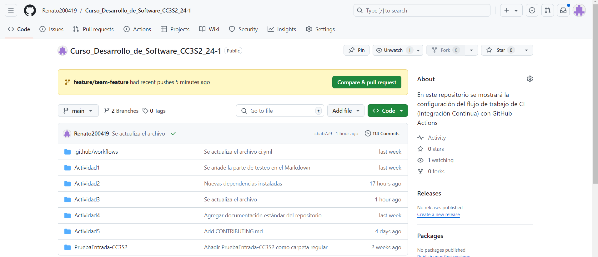
 - Añade una descripción detallada del PR, explicando los cambios realizados y su propósito.
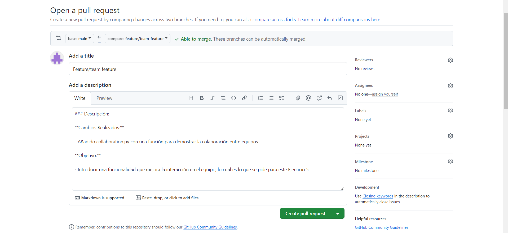
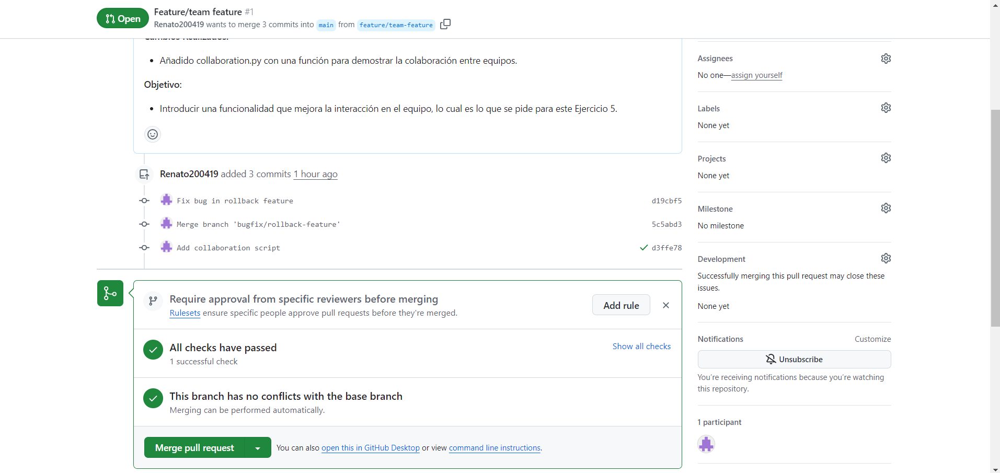

5. Revisar y Fusionar el Pull Request:
 - Simula la revisión de código, comenta en el PR y realiza cualquier cambio necesario basado en la retroalimentación.
 - Una vez aprobado, fusiona el PR en la rama main.
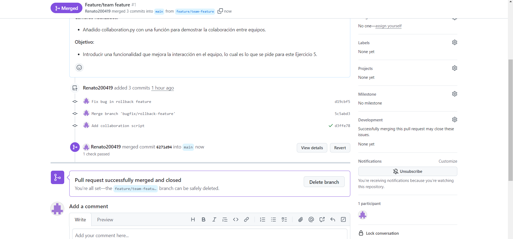
6. Eliminar la rama remota y local:

 - Después de la fusión, elimina la rama tanto local como remotamente:
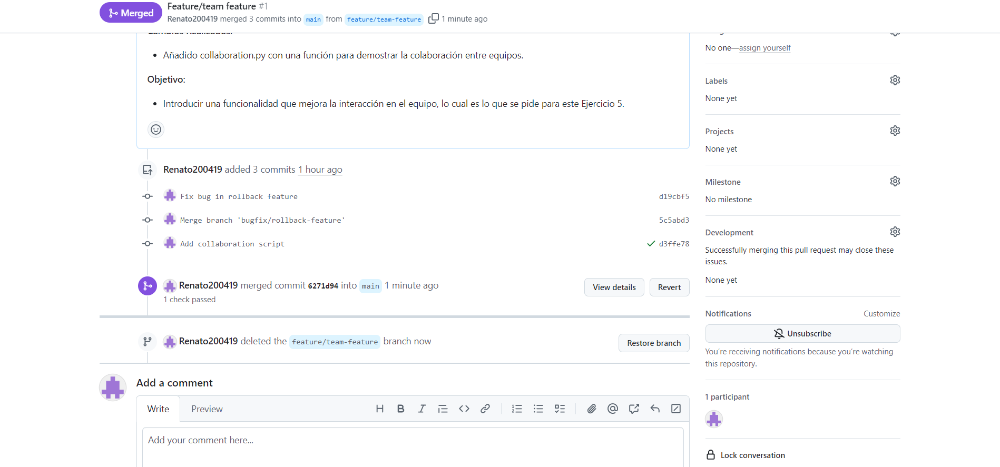

```bash
$ git branch -d feature/team-feature
$ git push origin --delete feature/team-feature
```

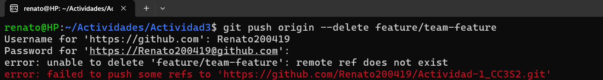

Sale esa línea roja ya que se eliminó la rama a través de la interfaz web de GitHub después de fusionar el Pull Request.

## Ejercicio 6: Cherry-Picking y Git Stash

**Objetivo:** Aprender a aplicar commits específicos a otra rama utilizando `git cherry-pick` y a guardar temporalmente cambios no confirmados utilizando `git stash`.

## Instrucciones:

1. Hacer cambios en main.py y confirmarlos:
 - Realiza y confirma varios cambios en main.py en la rama main:

```bash
$ echo "print('Cherry pick this\!')" >> main.py
$ git add main.py
$ git commit -m "Add cherry-pick example"  
```
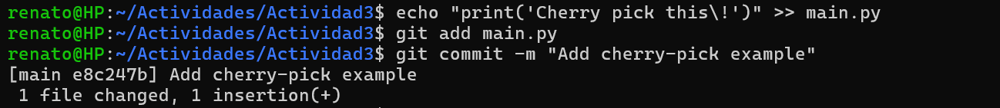

2. Crear una nueva rama y aplicar el commit específico:
 - Crea una nueva rama feature/cherry-pick y aplícale el commit específico:

```bash
$ git branch feature/cherry-pick
$ git checkout feature/cherry-pick
```
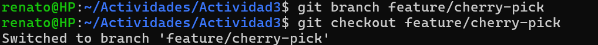

Cambiamos de rama a `main` y se escoge el hash del commit que sería el `e8c247b`


```bash
$ git cherry-pick <commit-hash>
```
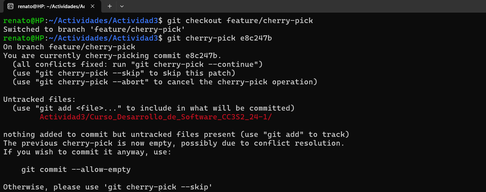

Se hizo una verificación de los cambios en el commit específico

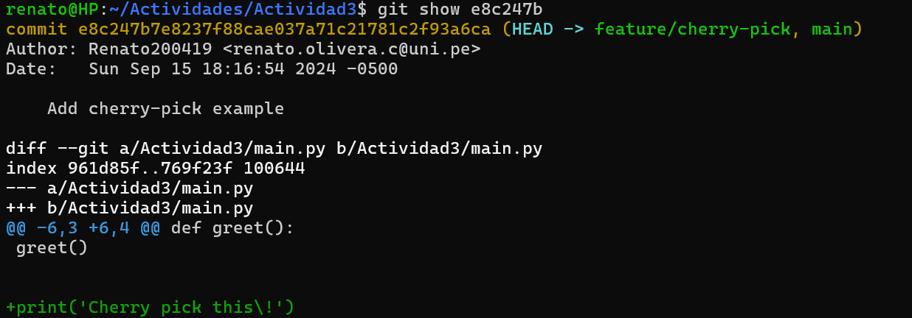

3. Guardar temporalmente cambios no confirmados:
 - Realiza algunos cambios en main.py pero no los confirmes:
```bash
$ echo "This change is stashed" >> main.py
$ git status
```
 - Guarda temporalmente estos cambios utilizando git stash:
```bash
$ git stash
```
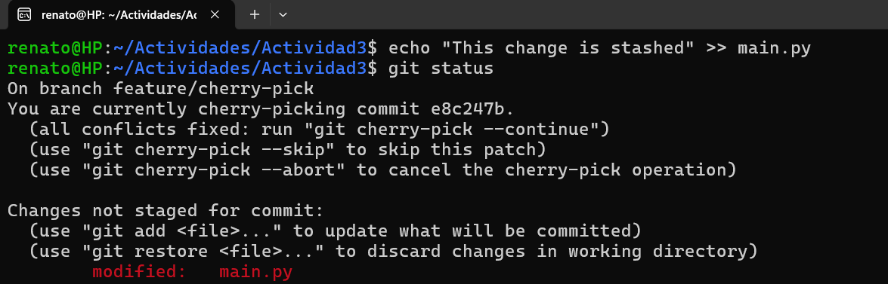

4. Aplicar los cambios guardados:
 - Realiza otros cambios y confírmalos si es necesario.
 Se agrega lo siguiente:
```bash
$ echo "New changes to main.py" >> main.py
$ git add main.py
$ git commit -m "Make additional changes to main.py"
```
 - Luego, recupera los cambios guardados anteriormente:

```bash
$ git stash pop
```
5. Revisar el historial y confirmar la correcta aplicación de los cambios:
 - Usa git log para revisar el historial de commits y verificar que todos los cambios se han aplicado correctamente.
```bash
$ git log
```
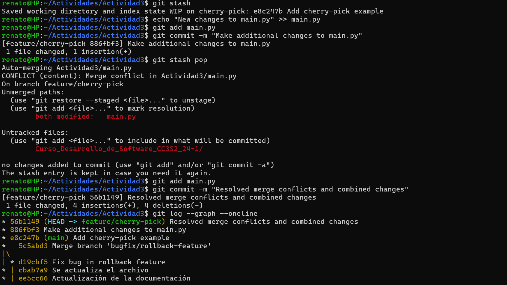