# Actividad 4
El procedimiento de esta Actividad se realizó en clase el día 09/09/24 por tal razón no se documentó.
# Objetivo: Entender y comparar las estrategias de fusión Fast-Forward, No Fast-Forward y Squash en Git, viendo cómo impactan en el historial. Esto te ayuda a elegir la mejor estrategia para mantener un historial claro y manejable en proyectos colaborativos.

## Uso de subtrees: 
Usar los **subtrees** `git subtree` son una forma de incluir un repositorio externo dentro de tu propio repositorio. Esto te permite trabajar con otros proyectos o bibliotecas de manera más sencilla.

Ejemplo:
1. Nos posicionamos en el directorio principal
2. Agregar el Repositorio como remote
3. Integrar el Repositorio Usando git subtree
4. Eliminar el remote [el cual ya no se usará más y se mantiene solo los remotes necesarios ayuda a evitar confusiones ]

```bash
\\wsl.localhost\Ubuntu\home\renato\Actividades
git remote add -f ejercicio-fusion [URL del repositorio ejercicio fusion]
git subtree add --prefix=Actividades/Actividad6/ejercicio-fusion ejercicio-fusion main
git remote remove ejercicio-fusion
``` 

# Ejercicio 1: Clona un repositorio Git con múltiples ramas.

1. Primero creamos un repositorio secundario para trabajar cómodamente junto con sus ramas y un archivo.txt el cual nos servirá de base para este proceso. Link del repositorio: https://github.com/Renato200419/fusion_ejercicios_actividad4
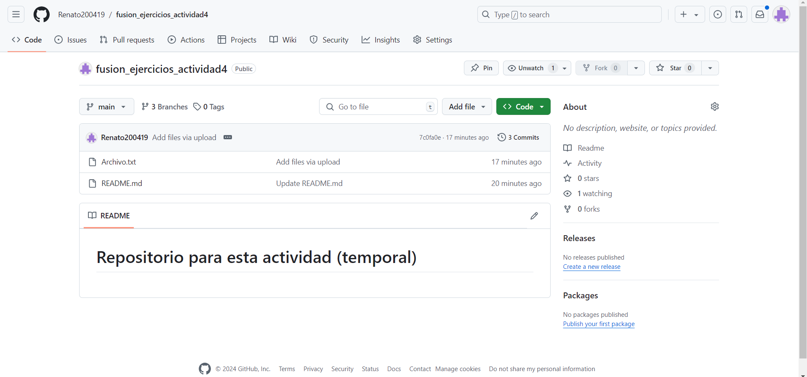

2. Luego se clona el repositorio en nuestro directorio raíz, también se traen las ramas remotas a local
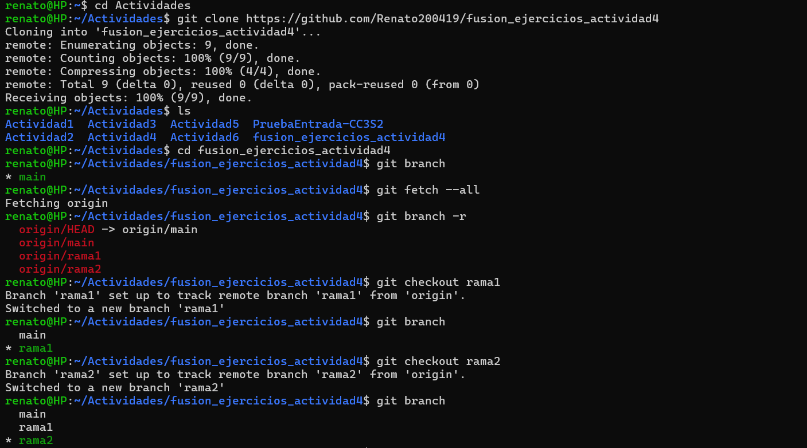

3. Revisamos nuestro Archivo.txt en main:
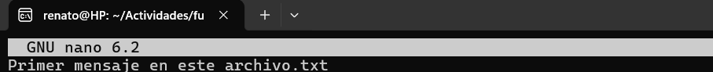

4. Luego se edita y se guarda el Archivo.txt en rama1, para pasar a rama2 se hace un `git add [nombre_archivo]` y un `git commit -m "mensaje"`. 

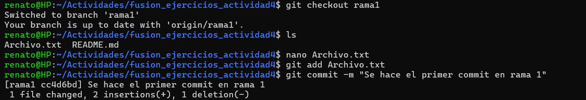

A continuación se muestra el contenido del Archivo.txt en cada rama respectivamente

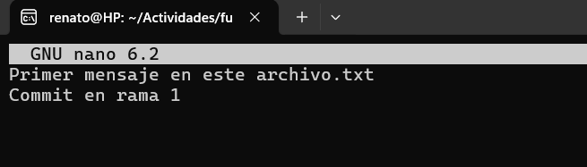

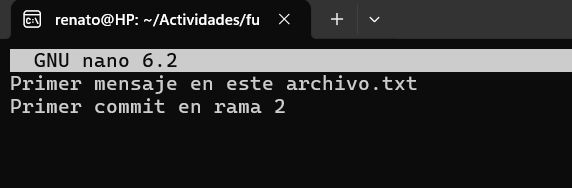

- Identifica dos ramas [en nuestro caso rama1 y rama2]que puedas fusionar utilizando git merge --ff.
- Haz el proceso de fusión utilizando git merge --ff.
- Verifica el historial con git log --graph --oneline

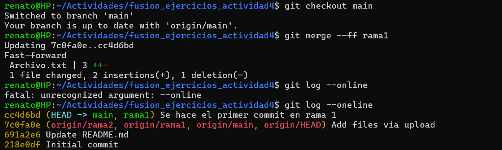


## Pregunta: ¿En qué situaciones recomendarías evitar el uso de `git merge --ff`? Reflexiona sobre las desventajas de este método
A lo largo de esta actividad sabemos que `git merge -ff`solo llevará a cabo la fusión si puede hacerla de manera rápida (sin crear un nuevo commit de fusión). Por lo tanto, recomendaría evitar el uso de `git merge --ff` en situaciones donde es importante preservar el contexto histórico de las fusiones, especialmente en proyectos colaborativos o equipos grandes. De las cuales algunas desventajas son las siguientes:

 - **Pérdida del punto de fusión**: No se crea un commit de fusión, lo que puede dificultar rastrear cuándo y cómo se unieron ramas.
 - **Historial menos claro**: En proyectos con múltiples contribuciones paralelas, el historial puede ser más difícil de entender sin commits de fusión que marquen claramente las integraciones.

# Ejercicio 2: Simula un flujo de trabajo de equipo

- Trabaja en dos ramas independientes, creando diferentes cambios en cada una.
1. Usando el mismo repositorio(el temporal), ahora usaremos `git merge --no-ff` cuales ramas serían: main y rama2

- Fusiona ambas ramas con git merge --no-ff para ver cómo se crean los commits de fusión. **En este caso hubo un commit de fusión explícito ya que hubiera sido implícito si no hubiera habido conflictos**
2. Vemos que hay un conflicto para eso editamos el archivo en el cual vamos a combinar ambos mensajes, es decir, aceptamos los 3 mensajes en el Archivo.txt

```txt
Primer mensaje en este archivo.txt
Commit en rama 1
Primer commit en rama 2
```
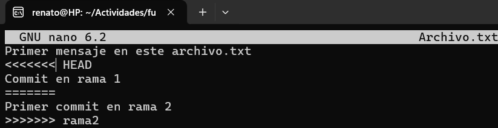
- Observa el historial utilizando git log --graph --oneline.
3. Luego hacemos un `git add Archivo.txt` y `git commit -m "Conflicto resuelto"` una vez echo eso, revisamos el historial
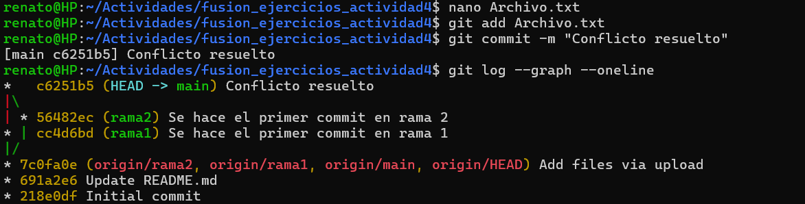

## Pregunta: 
1. ¿Cuáles son las principales ventajas de utilizar git merge --no-ff en un proyecto en equipo? 
- Historial bien definido: Crea un commit de fusión específico que muestra claramente cuándo y cómo se combinaron las ramas. Esto facilita la comprensión del historial.
- Seguimiento mejorado: Facilita la identificación del origen de características o correcciones, ya que los puntos de fusión quedan visibles en el historial. Esto ayuda a rastrear de dónde vienen los cambios.

2. ¿Qué problemas podrían surgir al depender excesivamente de commits de fusión?
- Historial desordenado: Si se abusa de los commits de fusión, el historial puede volverse confuso y difícil de seguir.
- Información innecesaria: Demasiados commits de fusión pueden añadir información irrelevante, especialmente si se crean fusiones para cambios menores o frecuentes. Esto puede hacer que el historial sea más difícil de leer..

# Ejercicio 3: Crea múltiples commits en una rama.
- Haz varios cambios y commits en una rama feature.
1. Se crea la rama `feature`, nos movemos a esa rama, se edita el Archivo.txt y se hacen los commits
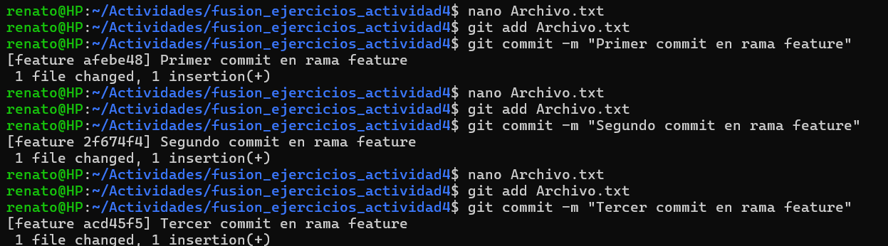
- Fusiona la rama con git merge --squash para aplanar todos los commits en uno solo.
- Verifica el historial de commits antes y después de la fusión para ver la diferencia.
2. Luego nos movemos a la rama `main` y realizamos el squash. Finalmente se realiza un único commit y verificamos el historial.

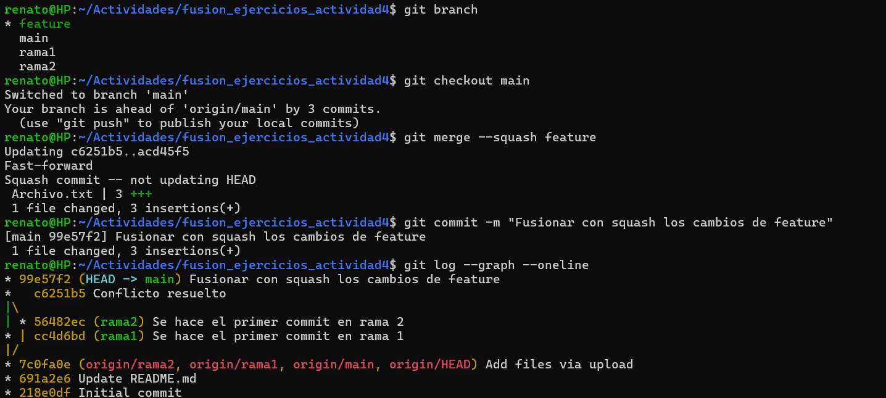

## Pregunta :¿Cuándo es recomendable utilizar una fusión squash? ¿Qué ventajas ofrece para proyectos grandes en comparación con fusiones estándar?
Es recomendable utilizar una fusión squash cuando se desea combinar múltiples commits menores en uno solo para mantener el historial limpio, como en desarrollos iterativos o cambios experimentales.

**Ventajas en proyectos grandes:**
- ***Historial claro y ordenado:*** Reduce el desorden de commits pequeños, haciendo el historial más fácil de leer.
- ***Visibilidad de cambios clave:*** Muestra solo los cambios importantes, facilitando el seguimiento del progreso.

# Ejercicio 4: Resolver conflictos en una fusión non-fast-forward
En algunos casos, las fusiones no son tan sencillas y pueden surgir conflictos que necesitas resolver manualmente. Este ejercicio te guiará a través del proceso de manejo de conflictos.

1. Inicializa un nuevo repositorio:

    ```bash
    mkdir try-merge-conflict
    cd try-merge-conflict
    git init
    ```

2. Crea un archivo `index.html` y realiza un commit en la rama `main`:

    ```bash
    echo "<html><body><h1>Proyecto inicial CC3S2</h1></body></html>" > index.html
    git add index.html
    git commit -m "commit inicial del index.html en main"
    ```

3. Crea y cambia a una nueva rama `feature-update`:

    ```bash
    git checkout -b feature-update
    ```

4. Edita el archivo y realiza un commit en la rama `feature-update`:

    ```bash
    echo "<p>.....</p>" >> index.html
    git add index.html
    git commit -m "Actualiza ..."
    ```

**Resultado de los pasos hecho hasta ahora, en mi caso ya no inicialicé el repositorio ya que se está subiendo los cambios en el repositorio principal. Para realizar con `git init` se usaría sub trees**

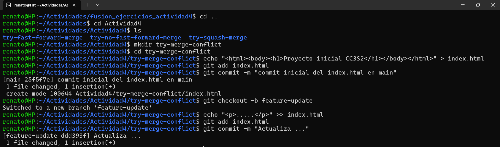

5. Regresa a la rama `main` y realiza una edición en el mismo archivo:

    ```bash
    git checkout main
    echo "<footer>Contacta aquí example@example.com</footer>" >> index.html
    git add index.html
    git commit -m "....index.html"
    ```

6. Fusiona la rama `feature-update` con `--no-ff` y observa el conflicto:

    ```bash
    git merge --no-ff feature-update
    ```

7. Git detectará un conflicto en `index.html`. Abre el archivo y resuelve el conflicto. Elimina las líneas de conflicto generadas por Git (`<<<<<<<`, `=======`, `>>>>>>>`) y crea la versión final del archivo con ambos cambios:

    ```html
    <html>
    <body>
    <h1>....</h1>
    <p>....</p>
    <footer>...example@example.com</footer>
    </body>
    </html>
    ```
**Resultado de los pasos hecho hasta ahora**
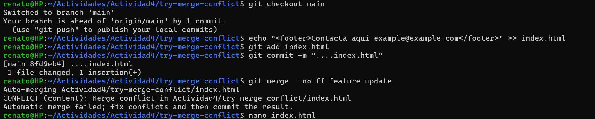

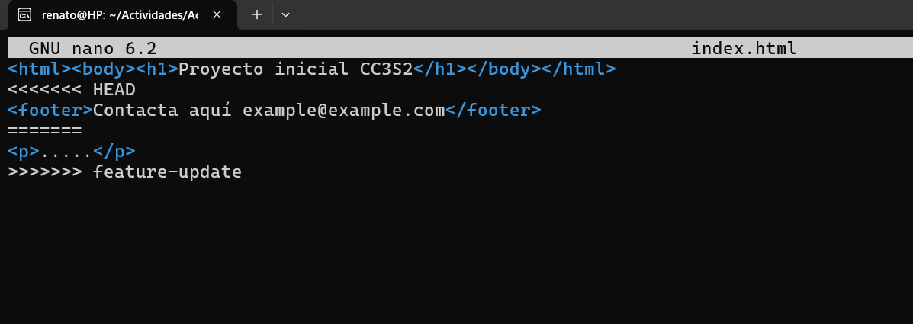

**Solucionando el conflicto**
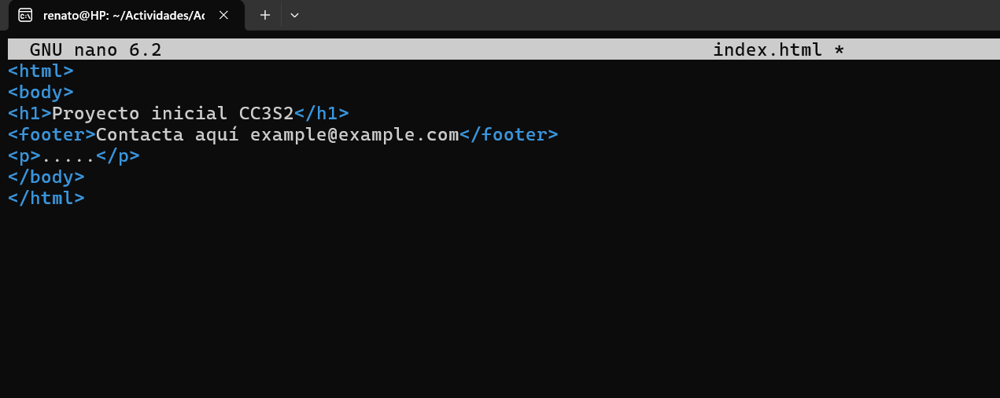

8. Agrega el archivo corregido y completa la fusión:

    ```bash
    git add index.html
    git commit
    ```

9. Verifica el historial para confirmar la fusión y el commit de resolución de conflicto:

    ```bash
    git log --graph --oneline
    ```

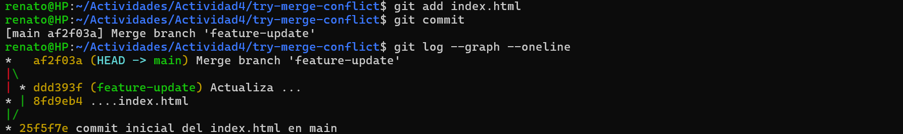

## Preguntas:
1. ¿Qué pasos adicionales tuviste que tomar para resolver el conflicto?
**Pasos adicionales para resolver el conflicto:**

1) Abrí el archivo con conflicto.
2) Identifiqué las líneas marcadas por Git (<<<<<<<, =======, >>>>>>>).
3) Combiné manualmente los cambios de ambas ramas.
4) Guardé el archivo, lo agregué (git add) y finalicé el merge con git commit.

2. ¿Qué estrategias podrías emplear para evitar conflictos en futuros desarrollos colaborativos?

- Mantener un diálogo abierto entre los miembros del equipo para evitar que varios trabajen en las mismas secciones del código al mismo tiempo.
- Realizar `git pull` regularmente para integrar los cambios del equipo y reducir el riesgo de conflictos.
- Utilizar ramas dedicadas para cada tarea o característica, y fusionarlas con frecuencia en la rama principal. Esto ayuda a mantener el código organizado y evita conflictos.

# Ejercicio 5: Comparar los historiales con git log después de diferentes fusiones
Este ejercicio te permitirá observar las diferencias en el historial generado por fusiones fast-forward, non-fast-forward y squash.

1. Crea un nuevo repositorio y realiza varios commits en dos ramas:

    ```bash
    mkdir try-compare-merge
    cd try-compare-merge
    git init
    echo "Version 1.0" > version.txt
    git add version.txt
    git commit -m "Versión inicial"
    git checkout -b feature-1
    echo "Característica 1 agregada" >> version.txt
    git add version.txt
    git commit -m "Agregar característica 1"
    git checkout main
    git checkout -b feature-2
    echo "Característica 2 agregada" >> version.txt
    git add version.txt
    git commit -m "Se agrega característica 2"
    ```

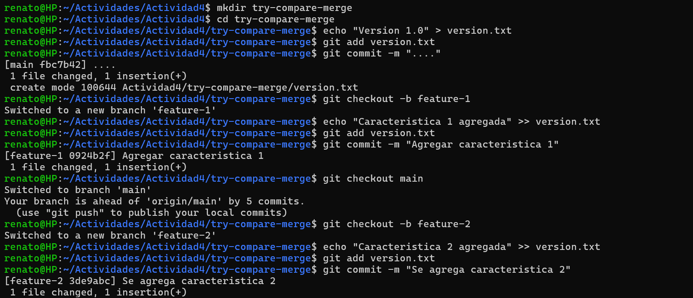

2. Fusiona `feature-1` usando fast-forward:

    ```bash
    git checkout main
    git merge feature-1 --ff
    ```
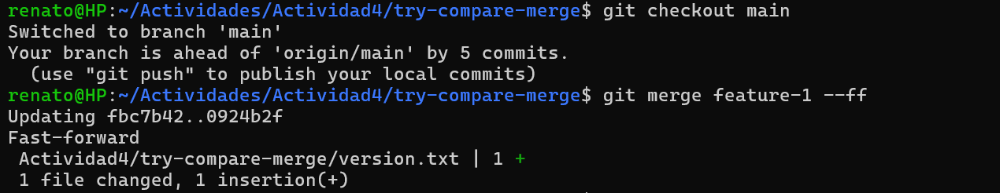
3. Fusiona `feature-2` usando non-fast-forward:

    ```bash
    git merge feature-2 --no-ff
    ```
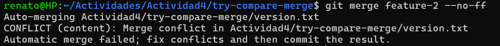

**Solucionamos el conflicto**
- Antes:

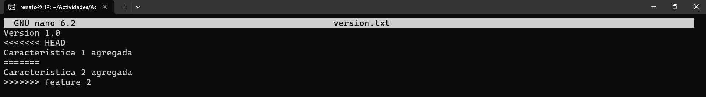

- Después:

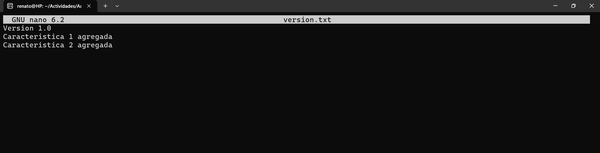

**Terminamos la fusión**


- Una vez que se hace el `git commit` procedemos a cerrar el archivo que se abre el cual nos indica que se realizó la fusión

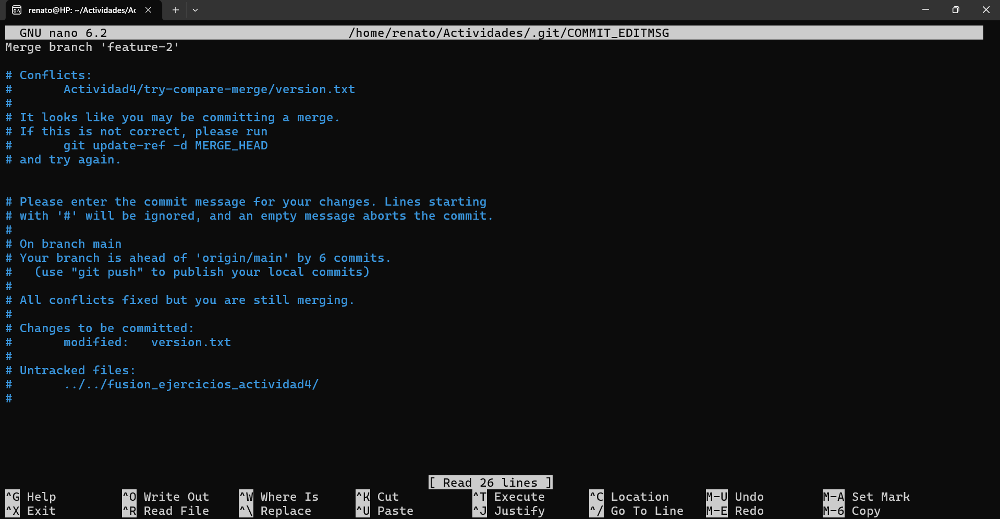

4. Realiza una nueva rama `feature-3` con múltiples commits y fusiónala con squash:

    ```bash
    git checkout -b feature-3
    echo "Característica 3 paso 1" >> version.txt
    git add version.txt
    git commit -m "Característica 3 paso 1"
    echo "Feature 3 step 2" >> version.txt
    git add version.txt
    git commit -m "Característica 3 paso 2"
    git checkout main
    git merge --squash feature-3
    git commit -m "Agregar característica 3 en un commit"
    ```
**Resultado de los pasos hecho hasta ahora**

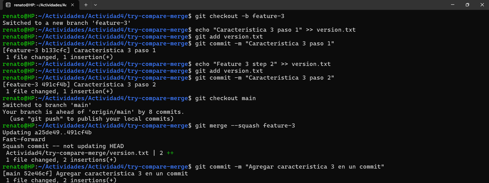

5. Compara el historial de Git:

    - **Historial Fast-forward:**
    
        ```bash
        git log --graph --oneline --merges --first-parent --branches
        ```

    - **Historial Non-fast-forward:**
    
        ```bash
        git log --graph --oneline --merges
        ```

    - **Historial con Squash:**
    
        ```bash
        git log --graph --oneline --merges --decorate --all
        ```
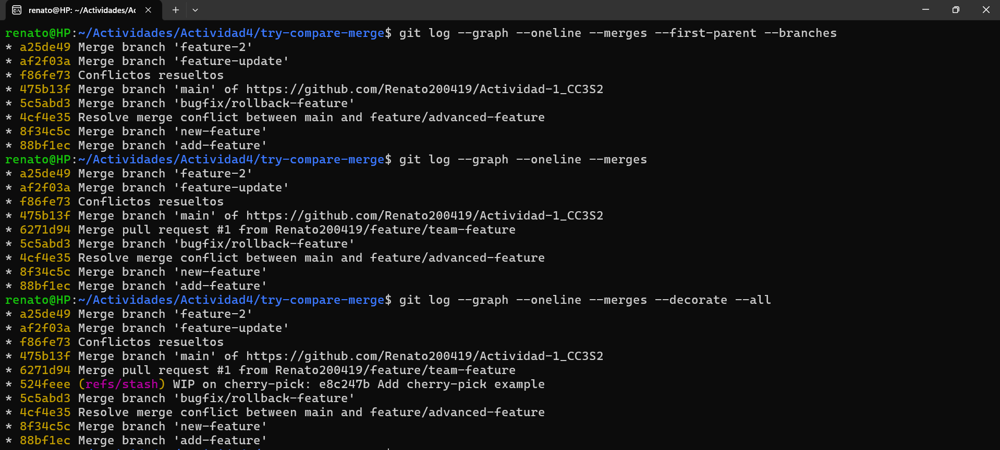

**Historial completo**
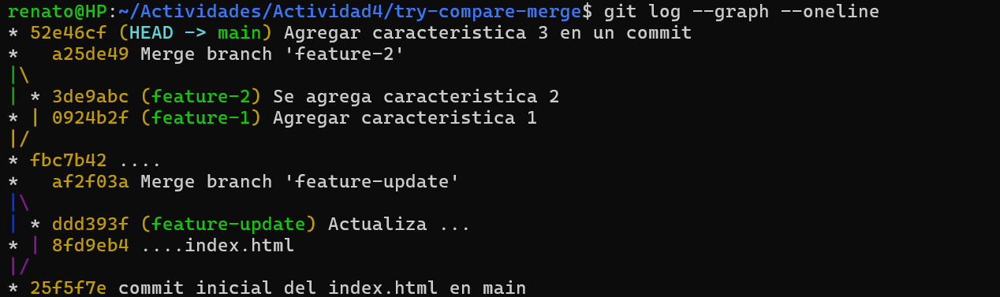

## Preguntas:
1. ¿Cómo se ve el historial en cada tipo de fusión?
* **Fast-forward**: El historial es lineal y continuo, sin crear un commit de fusión adicional.
* **Non-fast-forward**: Se crea un commit de fusión explícito, lo que marca el punto exacto donde las ramas se combinaron.
* **Squash**: Todos los commits de la rama se aplanan en un único commit, eliminando el detalle de los cambios intermedios en la rama.
2. ¿Qué método prefieres en diferentes escenarios y por qué?
* **Fast-forward**: Lo prefiero en proyectos pequeños o individuales, donde mantener un historial limpio y lineal es importante.
* **Non-fast-forward**: Ideal para proyectos colaborativos, ya que preserva el contexto y el punto de fusión, facilitando el seguimiento.
* **Squash**: Ideal para el uso en proyectos grandes donde los commits intermedios no son relevantes y se busca mantener un historial claro y conciso.

# Ejercicio 6: Usando fusiones automáticas y revertir fusiones
En este ejercicio, aprenderás cómo Git puede fusionar automáticamente cambios cuando no hay conflictos y cómo revertir una fusión si cometes un error.

1. Inicializa un nuevo repositorio y realiza dos commits en `main`:

    ```bash
    mkdir try-auto-merge
    cd try-auto-merge
    git init
    echo "Linea 1" > file.txt
    git add file.txt
    git commit -m "Agrega linea 1"
    echo "Linea 2" >> file.txt
    git add file.txt
    git commit -m "...linea 2"
    ```

2. Crea una nueva rama `auto-merge` y realiza otro commit en `file.txt`:

    ```bash
    git checkout -b auto-merge
    echo "Linea 3" >> file.txt
    git add file.txt
    git commit -m "... linea 3"
    ```

3. Vuelve a `main` y realiza cambios no conflictivos en otra parte del archivo:

    ```bash
    git checkout main
    echo "Footer: Fin del archivo" >> file.txt
    git add file.txt
    git commit -m "Add footer to file.txt"
    ```
**Resultado de los pasos hecho hasta ahora**

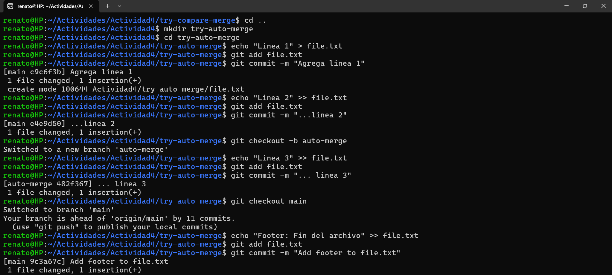

4. Fusiona la rama `auto-merge` con `main`:

    ```bash
    git merge auto-merge
    ```
    - Antes:

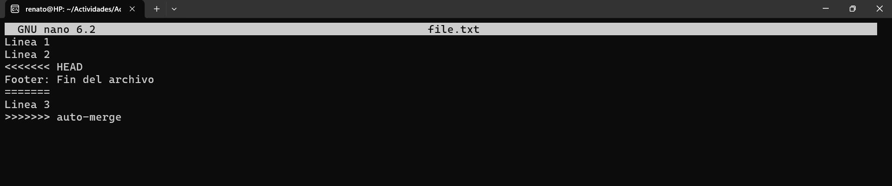

- Después:

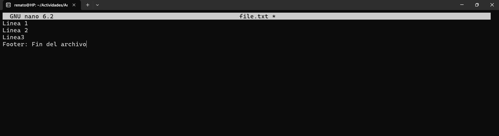

5. Git debería fusionar los cambios automáticamente sin conflictos.

6. Revertir la fusión: Si decides que la fusión fue un error, puedes revertirla:

    ```bash
    git revert -m 1 HEAD
    ```

**Al momento de hacer escribir el comando, saldrá un commit en el cual se confirma el revert, solo guardamos y cerramos**

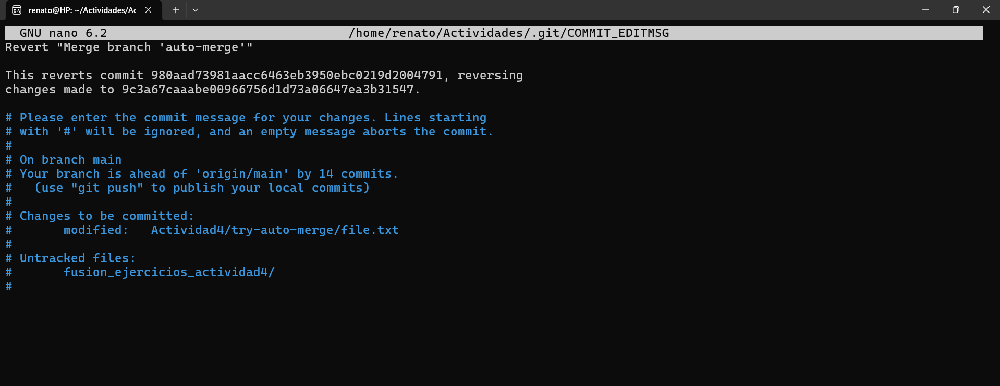

7. Verifica el historial:

    ```bash
    git log --graph --oneline
    ```


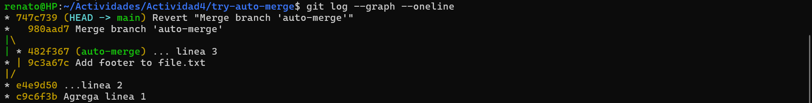

## Preguntas:
1. ¿Cuándo usarías un comando como git revert para deshacer una fusión?
Usaría `git revert` para deshacer una fusión si la fusión introdujo errores o cambios no deseados en el código, pero quiero **mantener el historial intacto** sin eliminar los commits previos.

2. ¿Qué tan útil es la función de fusión automática en Git?
La fusión automática en Git es muy útil porque **ahorra tiempo**al integrar cambios sin intervención manual, siempre y cuando no haya conflictos. Facilita el trabajo colaborativo al combinar ramas sin generar problemas, siempre que los cambios sean en diferentes partes del código.

# Ejercicio 7: Fusión remota en un repositorio colaborativo
Este ejercicio te permitirá practicar la fusión de ramas en un entorno remoto colaborativo, simulando un flujo de trabajo de equipo.
1. Clona un repositorio remoto desde GitHub o crea uno nuevo:

    ```bash
    git clone https://github.com/Renato200419/fusion_ejercicios_actividad4
    cd nombre-del-repositorio
    ```
**En nuestro caso ya clonamos el repositorio `fusion_ejercicios_actividad4` solo bastaría ubicarnos en la carpeta**

2. Crea una nueva rama `colaboracion` y haz algunos cambios:

    ```bash
    git checkout -b colaboracion
    echo "Colaboración remota" > colaboracion.txt
    git add colaboracion.txt
    git commit -m "Agrega archivo de colaboración"
    ```
3. Empuja los cambios a la rama remota:

    ```bash
    git push origin colaboracion
    ```
**Resultado de los pasos hecho hasta ahora**

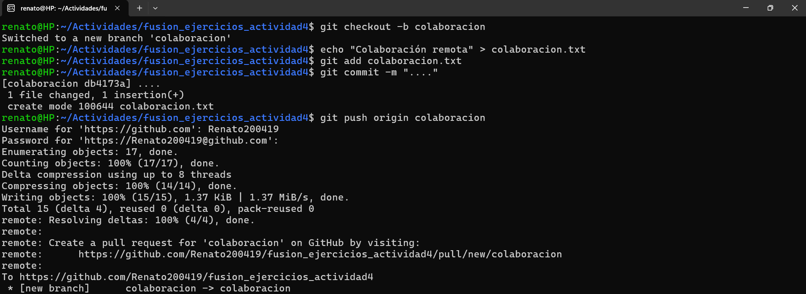

4. Simula una fusión desde la rama `colaboracion` en la rama `main` de otro colaborador. (Puedes usar la interfaz de GitHub para crear un Pull Request y realizar la fusión).
- Nos dirigimos a nuestro repositorio temporal y tenemos una opción de `compare and pull request`
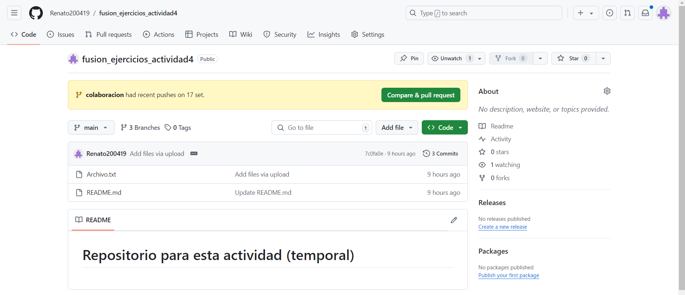
- Escribimos un título y una breve descrripción, luego creamos el `pull request`
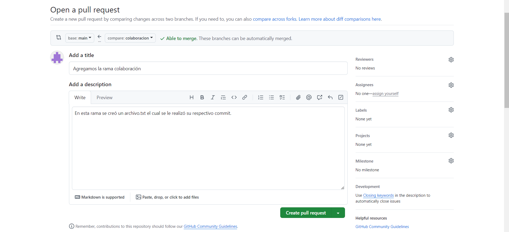
- Aceptamos en el botón verde

- Confirmamos la fusión 
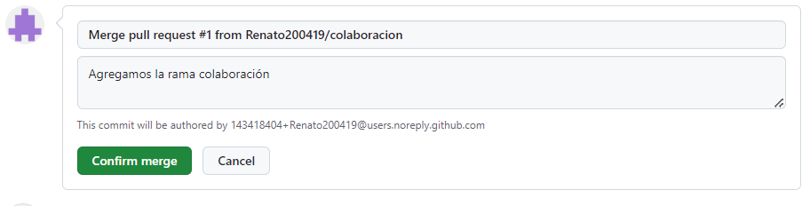
- Finalmente se logró !!!
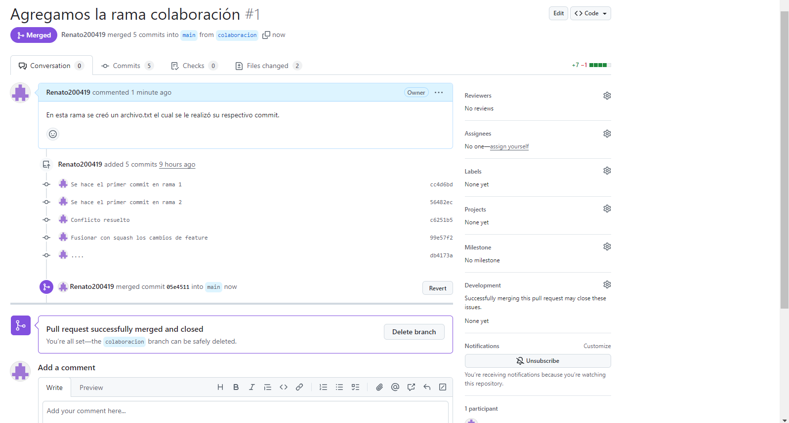

## Preguntas:
1. ¿Cómo cambia la estrategia de fusión cuando colaboras con otras personas en un repositorio remoto?

2. ¿Qué problemas comunes pueden surgir al integrar ramas remotas?


# Ejercicio Final: Flujo de Trabajo Completo

## 1. Configurar el proyecto simulado

### Paso 1: Crea el proyecto con tres ramas (`main`, `feature1`, `feature2`)


1. **Creamos un nuevo directorio y un repositorio de Git**:
   ```bash
   mkdir proyecto-simulado
   cd proyecto-simulado
   git init
   ```
2. **Creamos un archivo markdown`README.md` y hacemos el primer commit en `main`**:
   ```bash
   echo "# Proyecto Ejercicio Final" > README.md
   git add README.md
   git commit -m "Agregar README a la rama main"
   ```

**Resultado de los pasos hecho hasta ahora**
 - Por defecto se llamó `master` a nuestra rama pero la cambiamos de nombre a `main`:

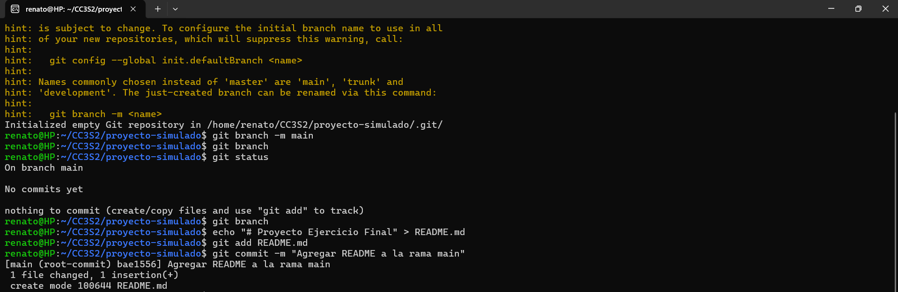

3. **Creamos y cambiamos de rama `feature1`**:
   ```bash
   git checkout -b feature1
   ```
4. **Creamos y cambiamos de rama `feature2`**:
   ```bash
   git checkout -b feature2
   ```
5. **Realizamos los cambios en las ramas respectivas:**
- **feature1**:
    ```bash
    git checkout feature1
    echo "Feature 1 actualización" > feature1.txt
    git add feature1.txt
    git commit -m "Feature 1 update"
    ```
- **feature2**:
    ```bash
    git checkout feature2
    echo "Feature 2 actualización" > feature2.txt
    git add feature2.txt
    git commit -m "Feature 2 update"
    ```
**Resultado de los pasos hecho hasta ahora**

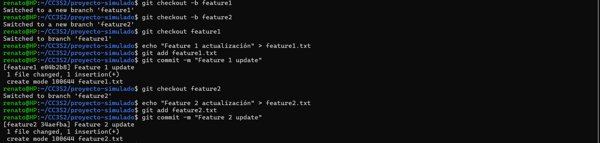

### Paso 2: Fusionar `feature2` en `main` utilizando `no-fast-forward (--no-ff)`

1. Fusionamos `feature1` con `main` utilizando **fast-forward**:
    ```bash
    git checkout main
    git merge feature1 --ff
    ```
    - Esto forzará la creación de un commit de fusión, dejando un punto claro de dónde se unieron ambas ramas.
2. Fusionamos `feature2` con `main` utilizando **no-fast-forward**:
    ```bash
    git checkout main
    git merge feature2 --no-ff
    ```
**Resultado de los pasos hecho hasta ahora**

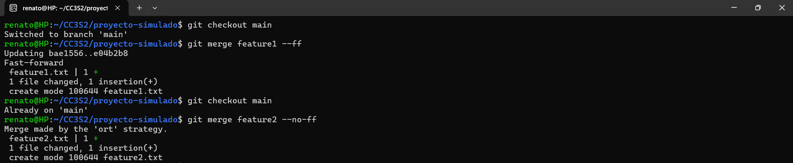

- Al momento de hacer el **no-fast-forward** se abrirá un archivo el cual guardamos y cerramos ya que se confirma la fusión.

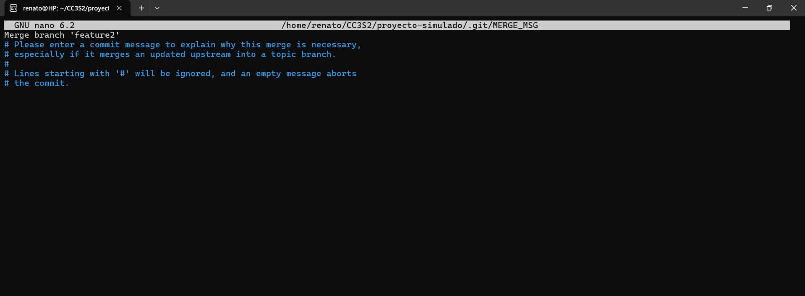

### Paso 3: Fusionar `feature3` utilizando `squash`
1. Se crea una nueva rama `feature3` y realizamos múltiples commits, luego fusionamos utilizando **squash**:

    ```bash
	git checkout -b feature3
	echo "Feature 3 paso 1" > feature3.txt
	git add feature3.txt
	git commit -m "Feature 3 paso 1"
	
	echo "Feature 3 paso 2" >> feature3.txt
	git add feature3.txt
	git commit -m "Feature 3 paso 2"
	
	git checkout main
	git merge --squash feature3
	git commit -m "Agregar feature 3 en un commit"
    ```

**Resultado de los pasos hecho hasta ahora**
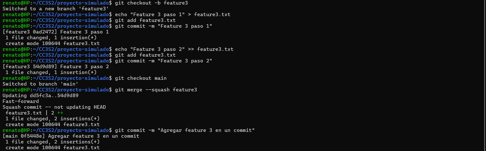

3. Analiza el historial de commits:
* Revisa el historial para entender cómo los diferentes métodos de fusión afectan el árbol de commits.
    ```bash
    git log --graph --oneline --all
    ```
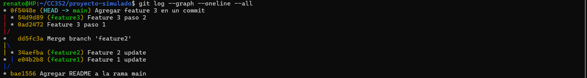

- **Fast-Forward (ff)**: La rama `feature1` se fusionó con `main` de manera lineal, sin crear un commit de fusión. Esto hace que los commits de `feature1` se integren directamente al historial de `main`, manteniéndolo limpio.

- **No Fast-Forward (no-ff)**: La rama `feature2` se fusionó creando un commit de fusión (`dd5fc3a`), lo que permite ver claramente cuándo y cómo se integró esta rama a main, útil para mantener el historial detallado.

- **Squash**: La rama `feature3` aplastó todos sus commits en uno solo (`0f5448e`), lo que limpia el historial de `main`, pero oculta los detalles de los commits individuales de `feature3`.

* Compara los resultados y discute con tus compañeros de equipo cuál sería la mejor estrategia de fusión para proyectos más grandes.
De acuerdo a lo discutido con mis compañeros para proyectos grandes, No Fast-Forward (no-ff) es la mejor estrategia, ya que mantiene un historial claro, mostrando cuándo y cómo se hicieron las fusiones, lo cual es importante para la trazabilidad en equipos grandes.
