# Actividad 5
- El procedimiento de esta Actividad se realizó en clase el día 11/09/24 por tal razón no se documentó.

## Uso de `git rebase`, `git cherry-pick` y repositorios
### Objetivo: Aprender a usar los comandos git rebase y git cherry-pick para mantener un historial de commits limpio y manejable en proyectos colaborativos. Y uso de subtrees como en la Actividad 4. Así como el uso de submódulos.

### Uso de Subtrees: Permiten incorporar y mantener un repositorio dentro de otro, facilitando la gestión de dependencias y la integración de proyectos sin necesidad de enlaces externos, todo mientras se conserva la historia de commits del proyecto incorporado.
#### Ejemplo:
1. Nos posicionamos en el directorio principal
2. Agregar el Repositorio como remote
3. Integrar el Repositorio Usando git subtree
4. Eliminar el remote [el cual ya no se usará más y se mantiene solo los remotes necesarios ayuda a evitar confusiones ]

```bash
\\wsl.localhost\Ubuntu\home\renato\Actividades
git remote add ci-cd-workflow /home/renato/CC3S2/ci-cd-workflow
git subtree add --prefix=Actividad5/ci-cd-workflow ci-cd-workflow main 
git remote remove ci-cd-workflow
``` 
---

### Uso de Submódulos: Son útiles para incluir y manejar dependencias de proyectos externos dentro de tu propio repositorio
#### Ejemplo:
1. **Navegar a la Raíz del Repositorio Principal**
   ```bash
   cd /home/renato/Actividades
   ```
2.  **Añadimos el submódulo**
    ```bash
    git submodule add https://github.com/Renato200419/scrum-project Actividad5/scrum-project
    ```
3. **Inicializar y Actualizar los Submódulos**
    ```bash
    git submodule init
    git submodule update
    ```
4. **Hacer Commit y Push de los Cambios**
    ```bash
    git add .
    git commit -m "Añadido scrum-project como submódulo en Actividad5"
    git push
    ```
# Preguntas de discusión
1. ¿Por qué se considera que rebase es más útil para mantener un historial de proyecto lineal en comparación con merge?
Rebase reorganiza los commits de una rama sobre otra, eliminando los "commits de fusión" adicionales que produce `merge`, lo que da como resultado un historial limpio y lineal.
2. ¿Qué problemas potenciales podrían surgir si haces rebase en una rama compartida con otros miembros del equipo?
Rebase reescribe el historial de commits, lo que puede generar conflictos y confusión si otros desarrolladores ya han basado su trabajo en esa rama, obligándolos a resolver conflictos al volver a integrar sus cambios.
3. ¿En qué se diferencia cherry-pick de merge, y en qué situaciones preferirías uno sobre el otro?
`Cherry-pick` selecciona y aplica commits específicos, mientras que `merge` integra todo el historial de una rama. Preferirías `cherry-pick` cuando solo necesitas mover algunos cambios específicos sin mezclar toda la rama.
4. ¿Por qué es importante evitar hacer rebase en ramas públicas?
El rebase reescribe el historial, lo que puede causar problemas si otros colaboradores ya han basado su trabajo en la versión anterior de la rama pública, generando confusión y conflictos de código difíciles de resolver.

# Ejercicios teóricos
1. Diferencias entre git merge y git rebase
**Pregunta**: Explica la diferencia entre git merge y git rebase y describe en qué escenarios sería más adecuado utilizar cada uno en un equipo de desarrollo ágil que sigue las prácticas de Scrum.

A continuación se explican las diferencias entre git merge y git rebase y escenarios en donde se usa más adecuado el Scrum:
   - `git merge`: Une ramas y crea un "commit de merge". Es perfecto para mantener la historia colectiva del equipo.
   - `git rebase`: Reescribe la historia para obtener un historial lineal. Ideal para limpiar antes de integrar cambios.
   - **En Scrum**: Se prefiere usar `merge` para la colaboración en equipo y `rebase` para ordenar el historial antes de cerrar el sprint.

2. Relación entre git rebase y DevOps
**Pregunta**: ¿Cómo crees que el uso de git rebase ayuda a mejorar las prácticas de DevOps, especialmente en la implementación continua (CI/CD)? Discute los beneficios de mantener un historial lineal en el contexto de una entrega continua de código y la automatización de pipelines.

El uso de `git rebase` en prácticas de DevOps, especialmente en CI/CD, mejora la claridad y la eficiencia del desarrollo. Al mantener un historial lineal, `git rebase` facilita la depuración y la revisión de código, simplifica la resolución de conflictos al re-aplicar cambios de manera incremental, y ayuda a automatizar y estabilizar los pipelines de CI/CD. Esto asegura que las integraciones sean predecibles y eficientes, esenciales para la entrega continua donde el código debe estar listo para producción en cualquier momento.


3. Impacto del git cherry-pick en un equipo Scrum
**Pregunta**: Un equipo Scrum ha finalizado un sprint, pero durante la integración final a la rama principal (main) descubren que solo algunos commits específicos de la rama de una funcionalidad deben aplicarse a producción. ¿Cómo podría ayudar git cherry-pick en este caso? Explica los beneficios y posibles complicaciones.

`git cherry-pick` permite aplicar commits específicos a producción, perfecto cuando solo algunas funcionalidades están listas. Esto evita mezclar cambios incompletos, aunque puede generar conflictos si no se maneja con cuidado.
---

# Ejercicios prácticos
**Nota**: Para estos ejercicios se usarán subtrees tal como se especificó ya que podríamos realizar `git init` sin tener ningún conflicto. Por tanto se trabajará en la 
## Ejercicio 1: Simulación de un flujo de trabajo Scrum con git rebase y git merge

### Pasos a realizar:
1.  Creamos un repositorio y haz algunos commits en la rama main
```bash
$ mkdir scrum-workflow
$ cd scrum-workflow
$ git init
$ echo "Commit inicial en main" > mainfile.md
$ git add mainfile.md
$ git commit -m "Commit inicial en main"
```


2. Creamos una rama feature, agrega nuevos commits, y luego se realiza algunos commits adicionales en main
```bash
$ git checkout -b feature
$ echo "Nueva característica en feature" > featurefile.md
$ git add featurefile.md
$ git commit -m "Commit en feature"
$ git checkout main
$ echo "Actualización en main" >> mainfile.md
$ git add mainfile.md
$ git commit -m "Actualización en main"
```

3. Realiza un rebase de feature sobre main.
```bash
$ git checkout feature
$ git rebase main
```
4. Finalmente, realiza una fusión fast-forward de feature con main
```bash
$ git checkout main
$ git merge feature --ff-only
```
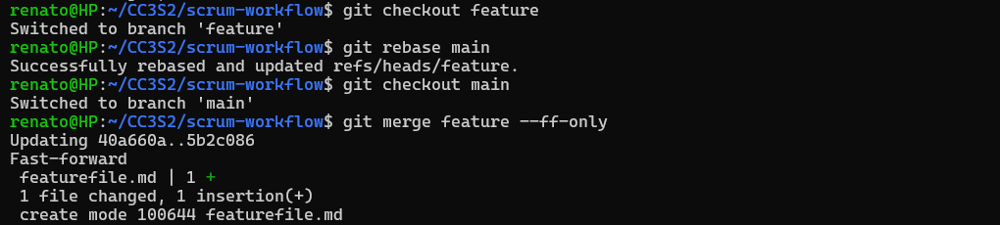

## Preguntas 
- ¿Qué sucede con el historial de commits después del rebase?
Los commits se reescriben y colocan encima de los commits de la rama a la que se ha hecho rebase, resultando en un historial lineal sin commits de fusión adicionales.
- ¿En qué situación aplicarías una fusión fast-forward en un proyecto ágil?
Aplicarías una fusión `fast-forward` cuando una rama de funcionalidad está completamente alineada con `main` y no hay commits nuevos en `main` desde que se creó la rama, permitiendo una fusión sin crear commits de fusión.

## Ejercicio 2: Cherry-pick para integración selectiva en un pipeline CI/CD
### Pasos a realizar:
1. Crea un repositorio con una rama main y una rama feature.
```bash
$ mkdir ci-cd-workflow
$ cd ci-cd-workflow
$ git init
$ echo "Commit inicial en main" > main.md
$ git add main.md
$ git commit -m "Commit inicial en main"
```
2. Haz varios commits en la rama feature, pero solo selecciona uno o dos commits específicos que consideres listos para producción.
```bash
$ git checkout -b feature
$ echo "Primera característica" > feature1.md
$ git add feature1.md
$ git commit -m "Agregar primera característica"
```
3. Realiza un cherry-pick de esos commits desde feature a main.

```bash
$ echo "Segunda característica" > feature2.md
$ git add feature2.md
$ git commit -m "Agregar segunda característica"
```
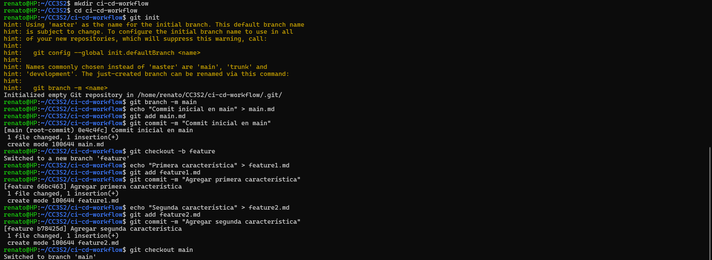
**Realizamos un log para poder ver los hash de los commits**

4. Verifica que los commits cherry-picked aparezcan en main.

```bash
$ git checkout main
$ git cherry-pick 66bc463
$ git cherry-pick b78425d
```
**Resultado**
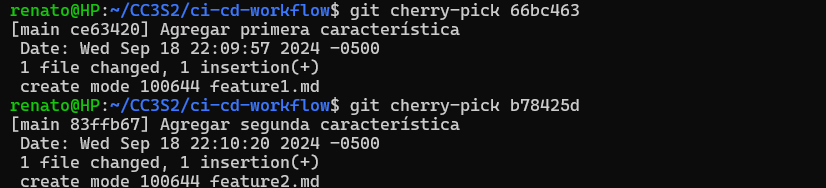


## Preguntas 

- ¿Cómo utilizarías cherry-pick en un pipeline de CI/CD para mover solo ciertos cambios listos a producción?
Utilizaría `cherry-pick`para seleccionar solo los commits que contienen cambios listos y estables para producción, sin tener que integrar toda la rama, lo que permite un despliegue controlado de características.
- ¿Qué ventajas ofrece cherry-pick en un flujo de trabajo de DevOps?
`Cherry-pick` ofrece la flexibilidad de seleccionar y mover cambios específicos a producción sin afectar o mezclar otros cambios en desarrollo, lo que permite una entrega más controlada y reduce el riesgo de introducir errores.


# Git, Scrum y Sprints
---
## Fase 1: Planificación del Sprint (Sprint Planning)
## Ejercicio 1: Crear ramas de funcionalidades (feature branches)
### Pasos a realizar:
1. Crea un repositorio en Git.
```bash
$ mkdir scrum-project
$ cd scrum-project
$ git init
$ echo "# Proyecto Scrum" > README.md
$ git add README.md
$ git commit -m "Commit inicial en main"
```
2. Crea una rama main donde estará el código base.
3. Crea una rama por cada historia de usuario asignada al sprint, partiendo de la rama main.
### Crear ramas de historias de usuario
```bash
$ git checkout -b feature-user-story-1
$ git checkout -b feature-user-story-2
```

**Resultado**
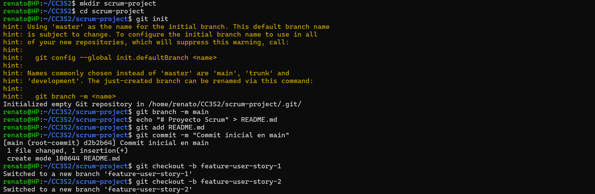

### Pregunta: ¿Por qué es importante trabajar en ramas de funcionalidades separadas durante un sprint?
Mantiene el trabajo aislado, evitando conflictos y permitiendo que cada desarrollador trabaje de manera independiente en su historia de usuario. Facilita la integración y revisión del código al final del sprint.
---
## Fase 2: Desarrollo del Sprint (Sprint Execution)
## Ejercicio 2: Integración continua con git rebase
### Pasos a realizar:

1. Haz algunos commits en main.
### Simula cambios en la rama main
```bash
$ git checkout main
$ echo "Actualización en main" > updates.md
$ git add updates.md
$ git commit -m "Actualizar main con nuevas funcionalidades"
```
2. Realiza un rebase de la rama feature-user-story-1 para actualizar su base con los últimos cambios de main.
### Rebase de la rama feature-user-story-1 sobre main
```bash
$ git checkout feature-user-story-1
$ git rebase main
```
**Resultado**
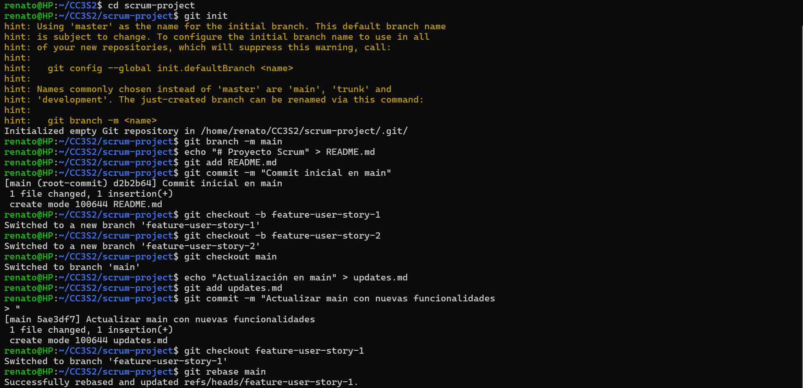

### Pregunta: ¿Qué ventajas proporciona el rebase durante el desarrollo de un sprint en términos de integración continua?
Rebase mantiene el historial lineal y ordenado, integrando los últimos cambios de `main` sin crear commits de fusión adicionales. Esto facilita la revisión del historial y reduce posibles conflictos futuros.
--- 
## Fase 3: Revisión del Sprint (Sprint Review)
## Ejercicio 3: Integración selectiva con git cherry-pick
### Pasos a realizar:

1. Realiza algunos commits en feature-user-story-2.
```bash
$ git checkout feature-user-story-2
$ echo "Funcionalidad lista" > feature2.md
$ git add feature2.md
$ git commit -m "Funcionalidad lista para revisión"
$ echo "Funcionalidad en progreso" > progress.md
$ git add progress.md
$ git commit -m "Funcionalidad aún en progreso"
```
2. Haz cherry-pick de los commits que estén listos para mostrarse a los stakeholders durante la revisión del sprint.
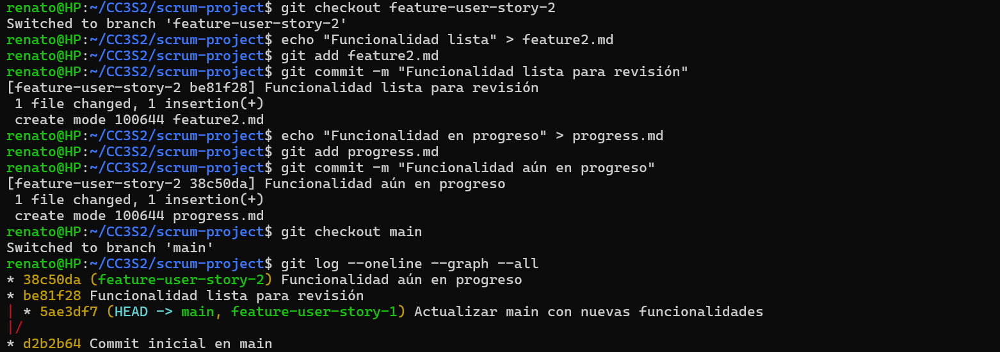
**Escogemos el hash que nos piden**
### Ahora selecciona solo el commit que esté listo
```bash
$ git checkout main
$ git cherry-pick be81f28
```
**Resultado**
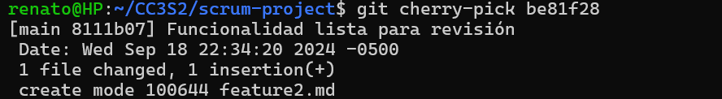

### Pregunta: ¿Cómo ayuda git cherry-pick a mostrar avances de forma selectiva en un sprint review?
Cherry-pick permite elegir solo los commits relevantes que están listos para ser presentados, sin tener que fusionar una rama completa que podría tener trabajo en progreso o no terminado.
---

## Fase 4: Retrospectiva del Sprint (Sprint Retrospective)
## Ejercicio 4: Revisión de conflictos y resolución
### Pasos a realizar:
1. Realiza cambios en feature-user-story-1 y feature-user-story-2 que resulten en conflictos.
```bash
$ git checkout feature-user-story-1
$ echo "Cambio en la misma línea" > conflicted-file.md
$ git add conflicted-file.md
$ git commit -m "Cambio en feature 1"
$ git checkout feature-user-story-2
$ echo "Cambio diferente en la misma línea" > conflicted-file.md
$ git add conflicted-file.md
$ git commit -m "Cambio en feature 2"
```
2. Intenta hacer merge de ambas ramas con main y resuelve los conflictos.

```bash
$ git checkout main
$ git merge feature-user-story-1
$ git merge feature-user-story-2

```
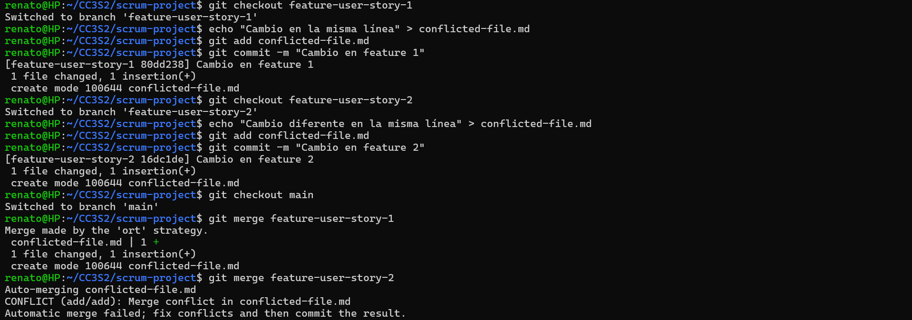

**Conflicto**
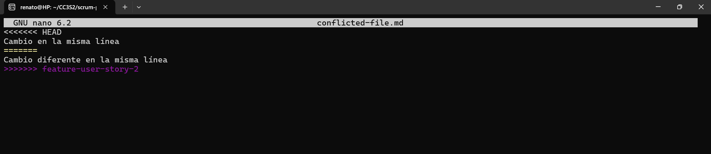

**Conflicto resuelto**
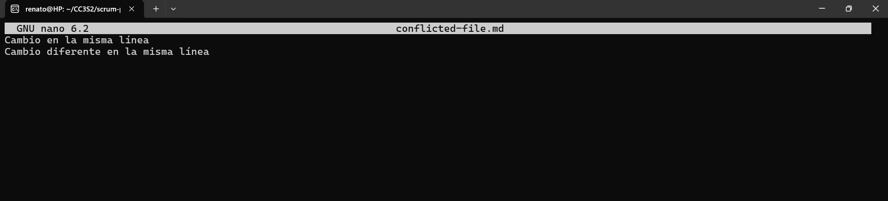

**Lo agregamos al área de preparación el archivo y le hacemos un commit**

```bash
git add conflicted-file.md
git commit -m "Conflicto resuelto entre feature 1 y feature 2"
```
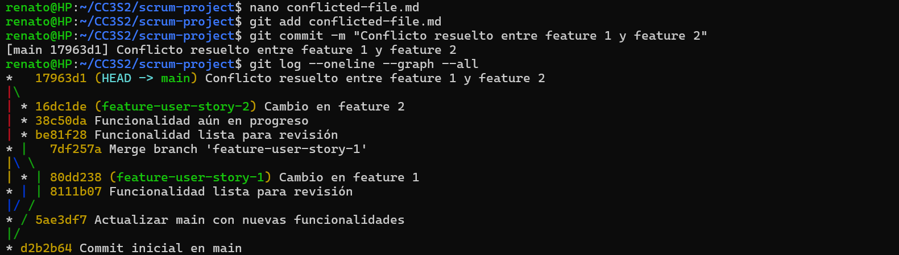

### Pregunta : ¿Cómo manejas los conflictos de fusión al final de un sprint? ¿Cómo puede el equipo mejorar la comunicación para evitar conflictos grandes?
Los conflictos se manejan resolviendo manualmente las diferencias durante el merge, y la comunicación mejora con una planificación clara, revisiones frecuentes del código y actualizaciones continuas desde main para minimizar los conflictos acumulados.

--- 

## Fase de desarrollo: automatización de integración ontinua (CI) con git rebase
## Ejercicio 5: Automatización de Rebase con Hooks de Git

### Pasos a realizar:
1. Configura un hook pre-push que haga un rebase automático de la rama main sobre la rama de funcionalidad antes de que el push sea exitoso.

```bash
$ nano .git/hooks/pre-push
# Agrega el siguiente script para automatizar el rebase
#!/bin/bash
git fetch origin main
git rebase origin/main
# Haz el archivo ejecutable
$ chmod +x .git/hooks/pre-push
```

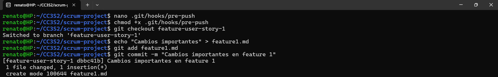

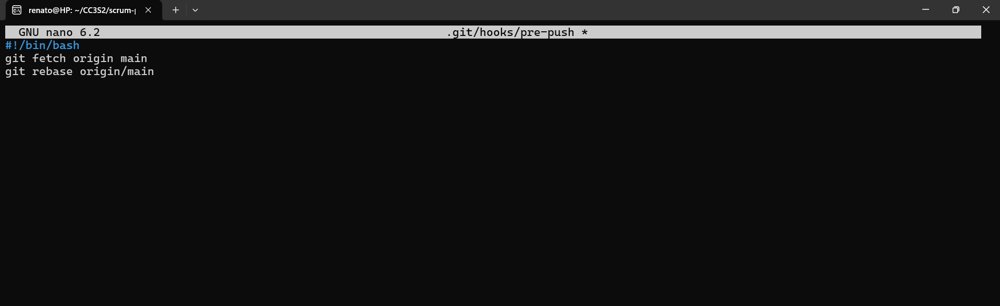
2. Prueba el hook haciendo push de algunos cambios en la rama feature-user-story-1.

```bash
# Simula cambios y haz push
$ git checkout feature-user-story-1
$ echo "Cambios importantes" > feature1.md
$ git add feature1.md
$ git commit -m "Cambios importantes en feature 1"
$ git push origin feature-user-story-1
```


#### Pasos adicionales:
1. Subimos nuestros avances a un repositorio temporal
```bash
git add .
git commit -m "Subir avances a scrum-project"
git remote add origin https://github.com/Renato200419/scrum-project.git
git push -u origin main
```
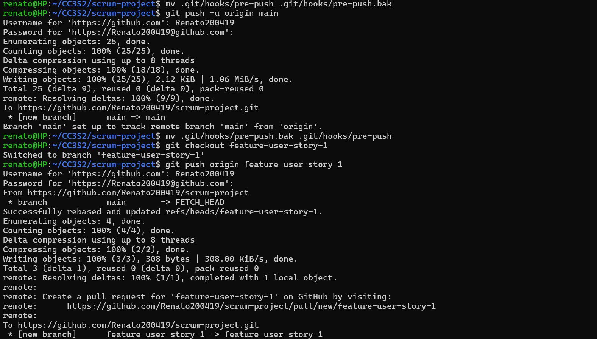
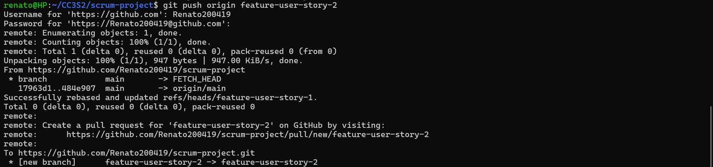
2. Si se presenta problemas, deshabilitamos temporalmente el hook `pre push`
```bash
mv .git/hooks/pre-push .git/hooks/pre-push.bak
```
3. Se hace `pull request` para subir los cambios de `feature-user-story-1`
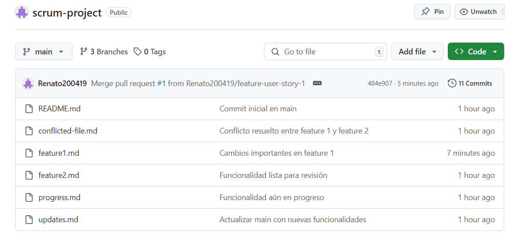
4. Link del repositorio: https://github.com/Renato200419/scrum-project
### Pregunta: ¿Qué ventajas y desventajas observas al automatizar el rebase en un entorno de CI/CD?

**Ventajas de automatizar el rebase en CI/CD:**
1. Mantiene un historial limpio y lineal.
2. Reduce conflictos al integrar cambios continuamente.
3. Ahorra tiempo al evitar rebase manual.

**Desventajas de automatizar el rebase en CI/CD:**
1. Reescribe el historial, lo que puede complicar ramas compartidas.
2. Los conflictos durante el rebase pueden detener el proceso CI/CD.
3. Dificulta la depuración si hay errores en la automatización.