# Actividad 6

## Objetivo: 
Gestionar conflictos en Git, fusionar cambios, usar herramientas para comparar, seguir buenas prácticas en versiones y aplicar versionado semántico en integración continua

### Elaboración de la Actividad 6
Esta actividad se realizó en el repositorio principal, se pudo haber hecho otro repositorio y subirlo como submódulo. Para las siguientes Actividades se usarán más submódulos o subtrees según como pida la actividad.
---

# Instrucciones:
## 1. Inicialización del proyecto y creación de ramas

```bash
# Crear un nuevo proyecto
mkdir proyecto-colaborativo
cd proyecto-colaborativo

# Inicializar Git
git init

# Crear un archivo de texto con contenido inicial
echo "Este es el contenido inicial del proyecto" > archivo_colaborativo.txt

# Agregar el archivo al área de staging y hacer el primer commit
git add .
git commit -m "Commit inicial con contenido base"

# Crear una nueva rama
git branch feature-branch

# Hacer checkout a la rama feature-branch y realizar un cambio
git checkout feature-branch
echo "Este es un cambio en la feature-branch" >> archivo_colaborativo.txt
git add .
git commit -m "Cambios en feature-branch"

# Regresar a la rama main y realizar otro cambio
git checkout main
echo "Este es un cambio en la rama main" >> archivo_colaborativo.txt
git add .
git commit -m "Cambios en main"
```
**Resultado**:
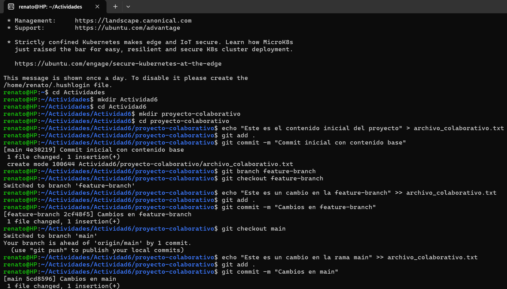


## 2. Fusión y resolución de conflictos
```bash
# Intentar fusionar feature-branch en main
git merge feature-branch

# Identificar archivos en conflicto
git status

# Resolver conflictos manualmente
git checkout --theirs <archivo> # Aceptar cambios de feature-branch
git checkout --ours <archivo>   # Aceptar cambios de main

# Commitear los archivos resueltos
git add .
git commit -m "Conflictos resueltos"
```
**Resultado**:
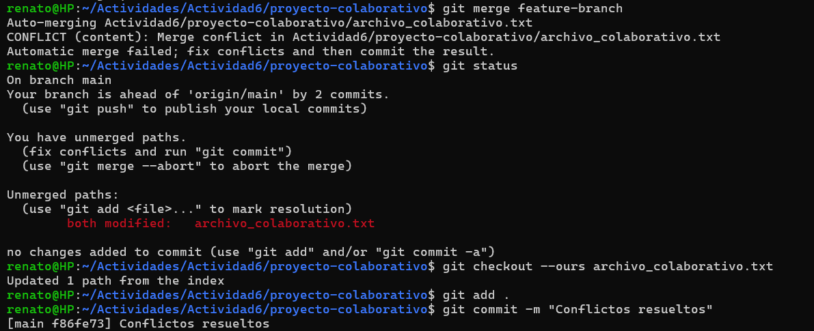


## 3. Simulación de fusiones y uso de `git diff`

```bash
# Simular una fusión
git merge --no-commit --no-ff feature-branch

# Ver cambios en el área de staging
git diff --cached 

# Abortar la fusión si no es lo que se esperaba
git merge --abort
```
**Resultado**:
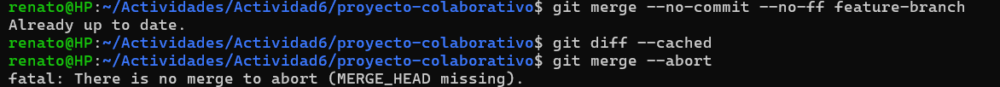

## 4. Uso de `git mergetool`
```bash
# Configurar git mergetool
git config --global merge.tool <nombre-herramienta>

# Iniciar la herramienta de fusión
git mergetool
```
**Resultado**:


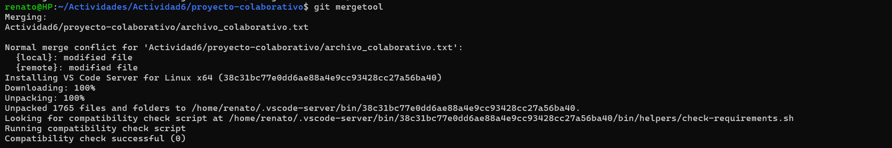

**Conflicto resuelto**

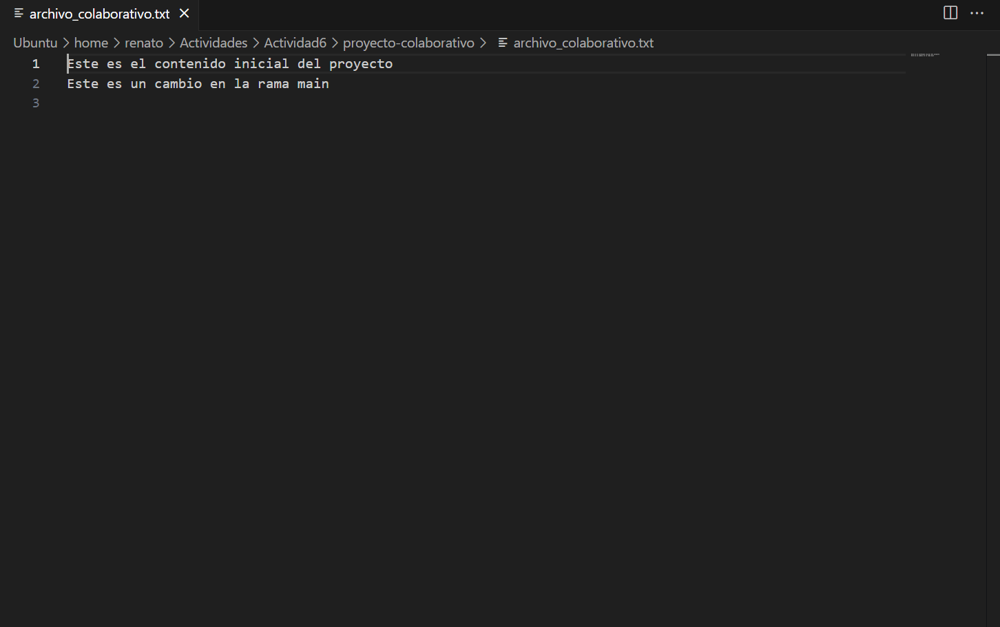

## 5. Uso de `git revert` y `git reset`

```bash
# Revertir un commit en main
git revert <commit_hash>

# Realizar un reset mixto
git reset --mixed <commit_hash>
```
**Resultado**:


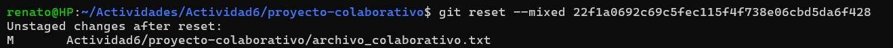
## 6. Versionado semántico y etiquetado
```bash
# Aplicar versionado semántico con tags
git tag -a v1.0.0 -m "Primera versión estable"
git push origin v1.0.0
```
**Resultado**:
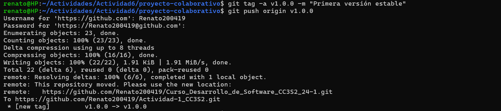

## 7. Aplicación de `git bisect` para depuración

```bash
# Iniciar bisect para identificar el commit que introdujo un error
git bisect start
git bisect bad # Indicar que la versión actual tiene un error
git bisect good <último_commit_bueno>

# Continuar marcando como "good" o "bad" hasta encontrar el commit problemático
git bisect reset # Salir del modo bisect
```

**Resultado**:


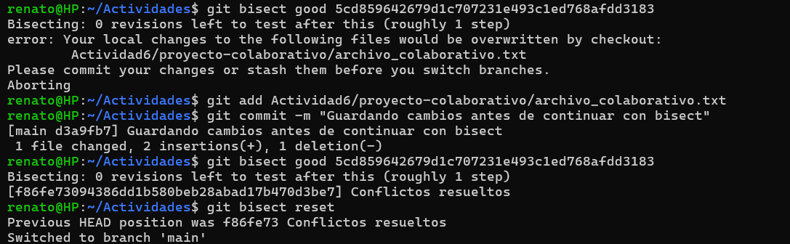


## 8. Reflexión sobre la utilidad de cada comando en un flujo de trabajo de DevOps.

Tenemos los siguientes comandos que se usan en un flujo de trabajo de DevOps:

1. **`git status`**:
   - Fundamental para la transparencia y organización del repositorio, esencial para evitar errores antes de fusiones o despliegues.

2. **`git checkout --ours/theirs`**:
   - Acelera la resolución de conflictos, asegura decisiones rápidas y efectivas sobre qué cambios conservar durante las fusiones.

3. **`git merge --no-commit --no-ff`**:
   - Permite probar fusiones antes de finalizarlas, clave para identificar y resolver problemas sin impactar la rama principal.

4. **`git diff`**:
   - Facilita la identificación de cambios y potenciales conflictos, mejorando la precisión en las revisiones de código.

5. **`git mergetool`**:
   - Ofrece una manera visual y colaborativa para resolver conflictos, optimizando la eficiencia en equipos grandes o distribuidos.

---

# Preguntas

## 1. Ejercicio para `git checkout --ours` y `git checkout --theirs`
**Contexto:** En un sprint ágil, dos equipos están trabajando en diferentes ramas. Se produce un conflicto de fusión en un archivo de configuración crucial. El equipo A quiere mantener sus cambios mientras el equipo B solo quiere conservar los suyos. El proceso de entrega continua está detenido debido a este conflicto.  
**Pregunta:**  
− ¿Cómo utilizarías los comandos `git checkout --ours` y `git checkout --theirs` para resolver este conflicto de manera rápida y eficiente? Explica cuándo preferirías usar cada uno de estos comandos y cómo impacta en la pipeline de CI/CD. ¿Cómo te asegurarías de que la resolución elegida no comprometa la calidad del código?   

**Respuesta:** Utilizaría `git checkout --ours` para conservar los cambios del equipo A y `git checkout --theirs` para los del equipo B en los archivos conflictivos. Esto permite resolver conflictos rápidamente y continuar con el proceso de CI/CD. Para asegurar la calidad del código, realizaría revisiones de código y pruebas automáticas después de aplicar estos comandos.


## 2. Ejercicio para `git diff`
**Contexto:** Durante una revisión de código en un entorno ágil, se observa que un pull request tiene una gran cantidad de cambios, muchos de los cuales no están relacionados con la funcionalidad principal. Estos cambios podrían generar conflictos con otras ramas en la pipeline de CI/CD.  
**Pregunta:**  
− Utilizando el comando `git diff`, ¿cómo compararías los cambios entre ramas para identificar diferencias específicas en archivos críticos? Explica cómo podrías utilizar `git diff feature-branch..main` para detectar posibles conflictos antes de realizar una fusión y cómo esto contribuye a mantener la estabilidad en un entorno ágil con CI/CD.

**Respuesta:** Emplearía `git diff feature-branch..main` para comparar los cambios entre las ramas y detectar diferencias críticas que podrían introducir conflictos. Este análisis ayuda a evitar errores antes de la fusión, manteniendo la estabilidad y facilitando un entorno ágil efectivo en CI/CD.


## 3. Ejercicio para `git merge --no-commit --no-ff`
**Contexto:** En un proyecto ágil con CI/CD, tu equipo quiere simular una fusión entre una rama de desarrollo y la rama principal para ver cómo se comporta el código sin comprometerlo inmediatamente en el repositorio. Esto es útil para identificar posibles problemas antes de completar la fusión.  
**Pregunta:**  
− Describe cómo usarías el comando `git merge --no-commit --no-ff` para simular una fusión en tu rama local. ¿Qué ventajas tiene esta práctica en un flujo de trabajo ágil con CI/CD, y cómo ayuda a minimizar errores antes de hacer commits definitivos? ¿Cómo automatizarías este paso dentro de una pipeline CI/CD?

**Respuesta:** Usaría este comando para fusionar las ramas de manera preliminar, permitiéndome revisar y probar el código antes de hacer el commit final. Las ventajas incluyen la minimización de errores y la mejora de la calidad del código. Para integrarlo en CI/CD, configuraría un paso automático en el pipeline que ejecute este comando en ciertos puntos, permitiendo revisiones antes de los commits definitivos.


## 4. Ejercicio para `git mergetool`
**Contexto:** Tu equipo de desarrollo utiliza herramientas gráficas para resolver conflictos de manera colaborativa. Algunos desarrolladores prefieren herramientas como `vimdiff` o Visual Studio Code. En medio de un sprint, varios archivos están en conflicto y los desarrolladores prefieren trabajar en un entorno visual para resolverlos.  
**Pregunta:**  
− Explica cómo configurarías y utilizarías `git mergetool` en tu equipo para integrar herramientas gráficas que faciliten la resolución de conflictos. ¿Qué impacto tiene el uso de `git mergetool` en un entorno de trabajo ágil con CI/CD, y cómo aseguras que todos los miembros del equipo mantengan consistencia en las resoluciones?

**Respuesta:** Configuraría `git mergetool` con herramientas como vimdiff o Visual Studio Code para que mi equipo pueda resolver conflictos de manera visual y colaborativa. Esto mejora la eficiencia y reduce errores durante las resoluciones de conflictos, crucial en un entorno ágil. 

Mantendría la consistencia en las resoluciones mediante configuraciones compartidas y formación adecuada sobre el uso de estas herramientas.


## 5. Ejercicio para `git reset`
**Contexto:** En un proyecto ágil, un desarrollador ha hecho un commit que rompe la pipeline de CI/CD. Se debe revertir el commit, pero se necesita hacerlo de manera que se mantenga el código en el directorio de trabajo sin deshacer los cambios.  
**Pregunta:**  
− Explica las diferencias entre `git reset --soft`, `git reset --mixed` y `git reset --hard`. ¿En qué escenarios dentro de un flujo de trabajo ágil con CI/CD utilizarías cada uno? Describe un caso en el que usarías `git reset --mixed` para corregir un commit sin perder los cambios no commiteados y cómo afecta esto a la pipeline.

**Respuesta:** Diferencias de los tipos de reset en escenarios dentro de un flujo de trabajo ágil con CI/CD: 
- `--soft` para deshacer commits manteniendo cambios en staging.
- `--mixed` para retirar cambios de staging pero no del directorio de trabajo.
- `--hard` para eliminar todos los cambios. 

En particular, usaría `--mixed` para corregir un commit erróneo sin perder los cambios, lo cual es vital para mantener la fluidez en CI/CD sin afectar la pipeline.

## 6. Ejercicio para `git revert`
**Contexto:** En un entorno de CI/CD, tu equipo ha desplegado una característica a producción, pero se ha detectado un bug crítico. La rama principal debe revertirse para restaurar la estabilidad, pero no puedes modificar el historial de commits debido a las políticas del equipo.  
**Pregunta:**  
− Explica cómo utilizarías `git revert` para deshacer los cambios sin modificar el historial de commits. ¿Cómo te aseguras de que esta acción no afecte la pipeline de CI/CD y permita una rápida recuperación del sistema? Proporciona un ejemplo detallado de cómo revertirías varios commits consecutivos.

**Respuesta:** Implementaría `git revert` para deshacer cambios mediante la creación de nuevos commits que revertirían los anteriores, manteniendo intacto el historial de commits. Por ejemplo, si necesitara revertir varios commits consecutivos, ejecutaría `git revert` en cadena para cada uno, asegurando una rápida recuperación y minimizando el impacto en la pipeline de CI/CD.


## 7. Ejercicio para `git stash`
**Contexto:** En un entorno ágil, tu equipo está trabajando en una corrección de errores urgente mientras tienes cambios no guardados en tu directorio de trabajo que aún no están listos para ser commitados. Sin embargo, necesitas cambiar rápidamente a una rama de hotfix para trabajar en la corrección.  
**Pregunta:**  
− Explica cómo utilizarías `git stash` para guardar temporalmente tus cambios y volver a ellos después de haber terminado el hotfix. ¿Qué impacto tiene el uso de `git stash` en un flujo de trabajo ágil con CI/CD cuando trabajas en múltiples tareas? ¿Cómo podrías automatizar el proceso de stashing dentro de una pipeline CI/CD?

**Respuesta:** Usaría `git stash` para guardar temporalmente mis cambios actuales y poder cambiar rápidamente a una rama de hotfix. Una vez resuelto el hotfix, recuperaría los cambios con `git stash pop`. Para CI/CD, automatizaría este proceso con scripts que manejen el stashing y aplicando de cambios basados en eventos específicos en el pipeline, facilitando el manejo de múltiples tareas de forma eficiente.


## 8. Ejercicio para `.gitignore`
**Contexto:** Tu equipo de desarrollo ágil está trabajando en varios entornos locales con configuraciones diferentes (archivos de logs, configuraciones personales). Estos archivos no deberían ser parte del control de versiones para evitar confusiones en la pipeline de CI/CD.  
**Pregunta:**  
− Diseña un archivo `.gitignore` que excluya archivos innecesarios en un entorno ágil de desarrollo. Explica por qué es importante mantener este archivo actualizado en un equipo colaborativo que utiliza CI/CD y cómo afecta la calidad y limpieza del código compartido en el repositorio.

**Respuesta:** 
Es importante actualizar el archivo `.gitignore` en un entorno de desarrollo ágil porque asegura que solo los archivos necesarios sean parte del control de versiones, evitando así la contaminación del repositorio con configuraciones locales y logs que pueden variar entre los desarrolladores. Esto no solo mantiene el código limpio y fácil de gestionar, sino que también optimiza las pipelines de CI/CD al eliminar el procesamiento de archivos irrelevantes, facilitando entregas más rápidas y estables.

***Pasos para crear el archivo .gitignore***

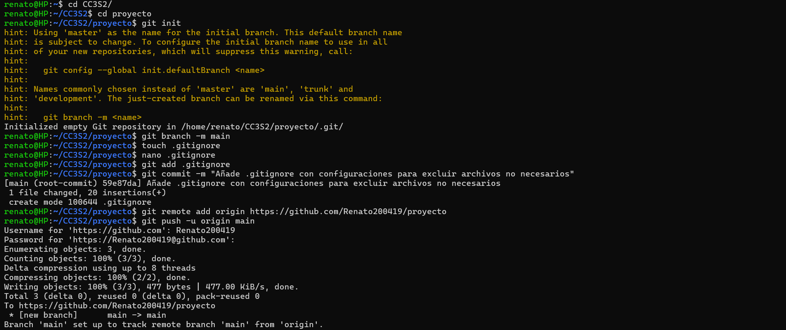

**Configuración del archivo:**
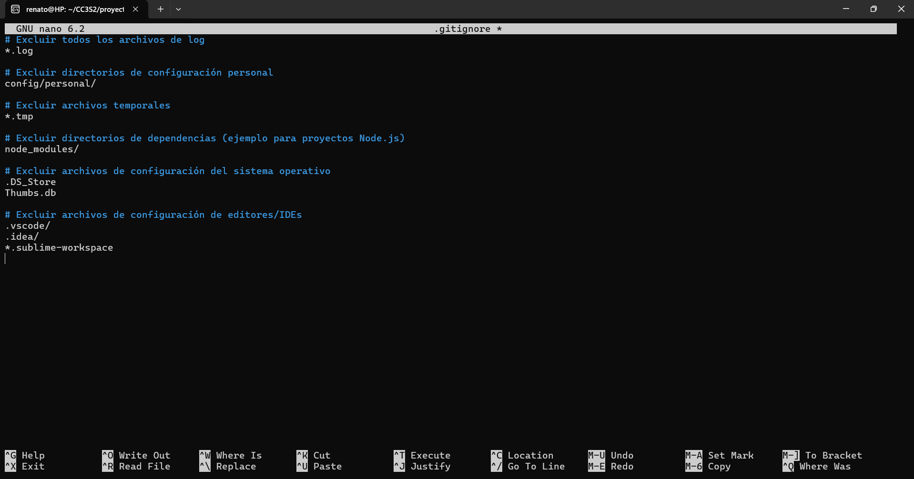
---
# Adicional

## Ejercicio 1: Resolución de conflictos en un entorno ágil
**Contexto:** Estás trabajando en un proyecto ágil donde múltiples desarrolladores están enviando cambios a la rama principal cada día. Durante una integración continua, se detectan conflictos de fusión entre las ramas de dos equipos que están trabajando en dos funcionalidades críticas. Ambos equipos han modificado el mismo archivo de configuración del proyecto.  
**Pregunta:**  
- ¿Cómo gestionarías la resolución de este conflicto de manera eficiente utilizando Git y manteniendo la entrega continua sin interrupciones? ¿Qué pasos seguirías para minimizar el impacto en la CI/CD y asegurar que el código final sea estable?

**Respuesta:** Para resolver conflictos eficientemente en un entorno ágil, me aseguraría de comunicar rápidamente el problema a ambos equipos. Usaría `git mergetool` para una resolución visual y rápida, seguido de pruebas automáticas para validar los cambios. Finalmente, integraría los cambios resueltos rápidamente para mantener el flujo continuo de CI/CD, asegurándome de que todas las partes estén de acuerdo con la solución adoptada.


## Ejercicio 2: Rebase vs. Merge en integraciones ágiles
**Contexto:** En tu equipo de desarrollo ágil, cada sprint incluye la integración de varias ramas de características. Algunos miembros del equipo prefieren realizar merge para mantener el historial completo de commits, mientras que otros prefieren rebase para mantener un historial lineal.  
**Pregunta:**  
- ¿Qué ventajas y desventajas presenta cada enfoque (merge vs. rebase) en el contexto de la metodología ágil? ¿Cómo impacta esto en la revisión de código, CI/CD, y en la identificación rápida de errores?

**Respuesta:** ***Merge*** mantiene un historial completo, facilitando la trazabilidad pero puede complicar el historial de commits. ***Rebase*** crea un historial lineal y limpio, ideal para proyectos que valoran la claridad sobre la cronología exacta de las contribuciones. En un entorno ágil (revisión de código, CI/CD, y en la identificación rápida de errores), rebase puede ayudar a identificar errores más rápidamente debido a su historial simplificado, aunque merge es más seguro para evitar complicaciones en ramas compartidas.


## Ejercicio 3: Git Hooks en un flujo de trabajo CI/CD ágil
**Contexto:** Tu equipo está utilizando Git y una pipeline de CI/CD que incluye tests unitarios, integración continua y despliegues automatizados. Sin embargo, algunos desarrolladores accidentalmente comiten código que no pasa los tests locales o no sigue las convenciones de estilo definidas por el equipo.  
**Pregunta:**  
- Diseña un conjunto de Git Hooks que ayudaría a mitigar estos problemas, integrando validaciones de estilo y tests automáticos antes de permitir los commits. Explica qué tipo de validaciones implementarías y cómo se relaciona esto con la calidad del código y la entrega continua en un entorno ágil.

**Respuesta:** Implementaría dos tipos de validaciones automáticas:

**Hooks de Git:**

- Pre-commit: Ejecuta linters para asegurar que el código cumple con nuestras convenciones de estilo.
- Pre-push: Corre tests unitarios para verificar que no se introduzcan errores antes de hacer push.

**Pipeline de CI/CD:**

- Incorporaría tests automatizados completos y análisis de código estático en cada push, detectando errores y problemas de seguridad tempranamente. 

***Pasos para diseñar el Git Hooks***
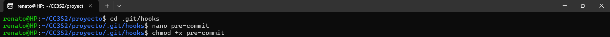


**Configuración del `pre- commit`**
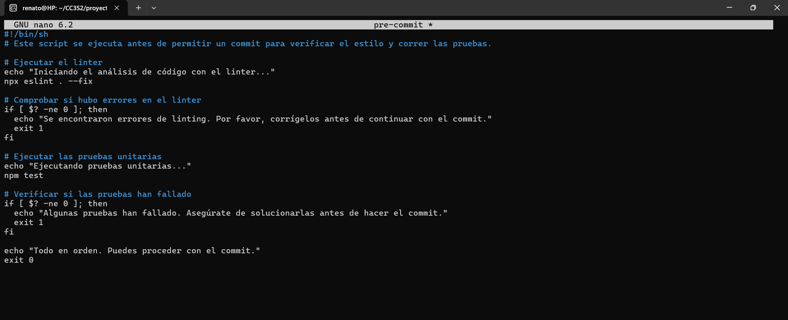

**Simulación**
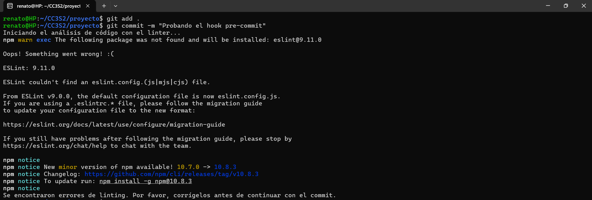

***Nota: Linter es una herramienta que analiza el código para detectar errores y mejorar su calidad.***

## Ejercicio 4: Estrategias de branching en metodologías ágiles
**Contexto:** Tu equipo de desarrollo sigue una metodología ágil y está utilizando Git Flow para gestionar el ciclo de vida de las ramas. Sin embargo, a medida que el equipo ha crecido, la gestión de las ramas se ha vuelto más compleja, lo que ha provocado retrasos en la integración y conflictos de fusión frecuentes.  
**Pregunta:**  
- Explica cómo adaptarías o modificarías la estrategia de branching para optimizar el flujo de trabajo del equipo en un entorno ágil y con integración continua. Considera cómo podrías integrar feature branches, release branches y hotfix branches de manera que apoyen la entrega continua y minimicen conflictos.

**Respuesta:** Optimizaría la estrategia de branching implementando feature branches para trabajos específicos, release branches para preparaciones de producción, y hotfix branches para problemas urgentes. Esta estructura soporta entregas continuas y minimiza conflictos al mantener separadas las actividades de desarrollo, lanzamiento y mantenimiento.


## Ejercicio 5: Automatización de reversiones con git en CI/CD
**Contexto:** Durante una integración continua en tu pipeline de CI/CD, se detecta un bug crítico después de haber fusionado varios commits a la rama principal. El equipo necesita revertir los cambios rápidamente para mantener la estabilidad del sistema.  
**Pregunta:**  
- ¿Cómo diseñarías un proceso automatizado con Git y CI/CD que permita revertir cambios de manera eficiente y segura? Describe cómo podrías integrar comandos como `git revert` o `git reset` en la pipeline y cuáles serían los pasos para garantizar que los bugs se reviertan sin afectar el desarrollo en curso.

**Respuesta:** Diseñaría un proceso en la pipeline de CI/CD que utilice **git revert** automáticamente para deshacer cambios que causen fallos críticos, seguido de pruebas automáticas para confirmar que el sistema vuelve a un estado funcional previo. Este proceso incluiría notificaciones automáticas para mantener informados a todos los miembros del equipo sobre la reversión y sus causas.